# CS2106 Notes AY23/24 Sem2

-   [CS2106 Notes AY23/24 Sem2](#cs2106-notes-ay2324-sem2)
    -   [Operating Systems](#operating-systems)
        -   [Operating System Structure](#operating-system-structure)
        -   [Running OSes](#running-oses)
    -   [Process Management](#process-management)
    -   [Process Abstraction](#process-abstraction)
        -   [Component Description](#component-description)
        -   [Basic Instruction Execution](#basic-instruction-execution)
        -   [Memory Context](#memory-context)
            -   [Function Call](#function-call)
            -   [Dynamically Allocated Memory](#dynamically-allocated-memory)
        -   [OS Context](#os-context)
            -   [Processes](#processes)
    -   [Process Abstraction in Unix](#process-abstraction-in-unix)
        -   [Zombie Process](#zombie-process)
        -   [Unix System Calls](#unix-system-calls)
    -   [Process Scheduling](#process-scheduling)
        -   [Concurrent Execution](#concurrent-execution)
        -   [Process Scheduling Algorithms](#process-scheduling-algorithms)
            -   [First-Come First-Serve: FCFS](#first-come-first-serve-fcfs)
            -   [Shortest Job First: SJF](#shortest-job-first-sjf)
            -   [Shortest Remaining Time: SRT](#shortest-remaining-time-srt)
            -   [Round Robin: RR](#round-robin-rr)
            -   [Priority Scheduling](#priority-scheduling)
            -   [Multi-level Feedback Queue (MLFQ)](#multi-level-feedback-queue-mlfq)
            -   [Lottery Scheduling](#lottery-scheduling)
        -   [Scheduling for Interactive Systems](#scheduling-for-interactive-systems)
    -   [Process Alternative - Threads](#process-alternative---threads)
        -   [Motivation for Thread](#motivation-for-thread)
        -   [Process and Thread](#process-and-thread)
        -   [Thread Models](#thread-models)
            -   [User Thread](#user-thread)
            -   [Kernel Thread](#kernel-thread)
            -   [Hybrid Thread Model](#hybrid-thread-model)
            -   [POSIX Threads: `pthread`](#posix-threads-pthread)
    -   [Inter-Process Communication (IPC)](#inter-process-communication-ipc)
        -   [Message Passing](#message-passing)
        -   [Unix Pipes](#unix-pipes)
        -   [Unix Signal](#unix-signal)
    -   [Synchronization](#synchronization)
        -   [Assembly Level Implementation](#assembly-level-implementation)
        -   [High Level Language Implementation](#high-level-language-implementation)
        -   [High Level Abstraction](#high-level-abstraction)
        -   [Classical Synchronization Problems](#classical-synchronization-problems)
        -   [Synchronization Implementations](#synchronization-implementations)
    -   [Memory Abstraction](#memory-abstraction)
        -   [Contiguous Memory Management](#contiguous-memory-management)
            -   [Memory Partitioning](#memory-partitioning)
    -   [Disjoint Memory Schemes](#disjoint-memory-schemes)
        -   [Paging](#paging)
            -   [Protection](#protection)
            -   [Page Sharing](#page-sharing)
        -   [Segmentation Scheme](#segmentation-scheme)
            -   [Segmentation with Paging](#segmentation-with-paging)
    -   [Virtual Memory Management](#virtual-memory-management)
        -   [Extended Paging Scheme](#extended-paging-scheme)
        -   [Issues](#issues)

## Operating Systems

-   Operating system: A program that acts as an intermediary between a computer user and the computer hardware.
-   Motivation for OS
    1. Abstraction:
        - Hide the different low level details
        - Present the common high level functionality to user
    2. Resource Allocator:
        - Manages all resources: CPU,Memory,Input/Outputdevices
        - Arbitrate potentially conflicting requests: for efficient and fair resource use
    3. Control Program:
        - Controls execution of programs: prevent errors and improper use of the computer and provides security and protection
-   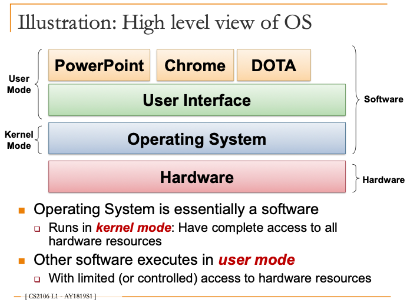
-   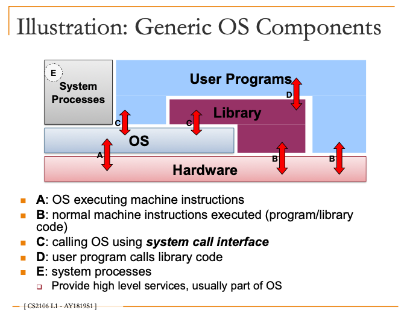
-   OS can protect a user program from other malicious applications
-   OS manages hardware resources for user programs

### Operating System Structure

-   A **monolithic** kernel is an operating system architecture where the entire operating system is working in kernel space
    -   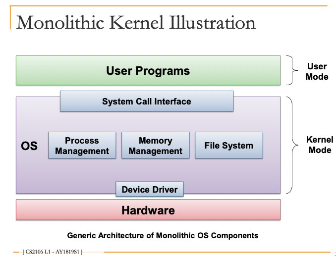
-   A **microkernel** architecture is an operating system pattern where only basic functionality is provided in the core of the software system
    -   Inter-Process Communication (IPC)
    -   Address space management
    -   Thread management
    -   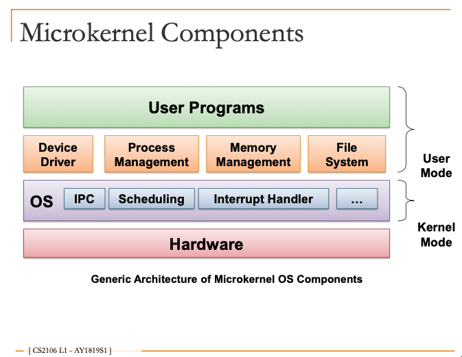
-   **Layered systems**
    -   Generalization of monolithic system
    -   Organize the components into hierarchy of layers
        -   Upper layers make use of the lower layers
        -   Lowest layer is the hardware
        -   Highest layer is the user interface
-   **Client-Server Model**
    -   Variation of microkernel
    -   Two classes of processes:
        -   Client process request service from server process
        -   Server Process built on top of the microkernel
        -   Client and Server process can be on separate machine!

### Running OSes

-   Motivation
    -   Operating system assumes total control of the hardware
    -   Operating system is hard to debug/ monitor
-   Definition
    -   **Virtual machine**: a software emulation of hardware, also known as hypervisor
    -   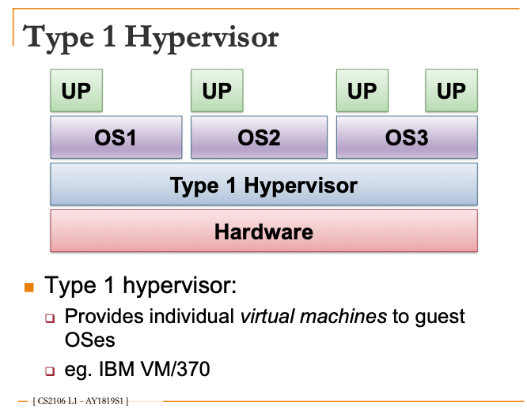
    -   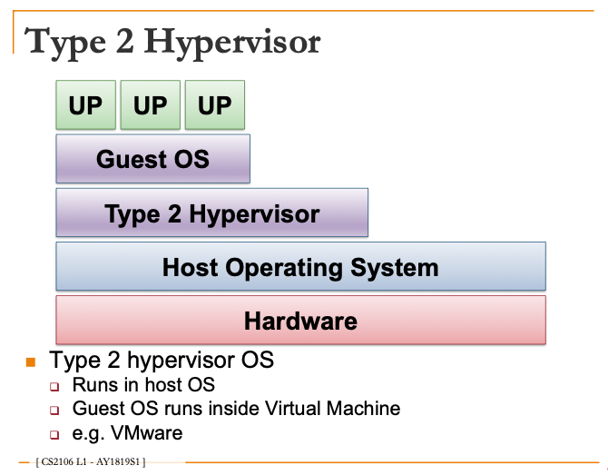

## Process Management

-   Process Abstraction
    -   Information describing an executing program
    -   Process/ Task/ Job is a dynamic abstracton for execution program
-   Process Scheduling
    -   Deciding which process get to execute
-   Inter-Process Communication & Synchronization
    -   Passing information between processes
-   Alternative to Process
    -   Light-weight process aka Thread

## Process Abstraction

### Component Description

-   Memory
    -   Storage for instruction and data
-   Cache
    -   Duplicate part of the memory for faster access
    -   Usually split into instruction cache and data cache
-   Fetch unit
    -   Loads instruction from memory
    -   Location indicated by a special register: Program Counter (PC)
-   Functional units
    -   Carry out the instruction execution
    -   Dedicated to different instruction type
-   Registers
    -   Internal storage for the fastest access speed
    -   General purpose registers: accessible by user program
    -   Special register: program counter

### Basic Instruction Execution

-   Instruction X is fetched
    -   Memory location indicated by Program Counter
-   Instruction X dispatched to the corresponding Functional Unit
    -   Read operands if applicable, usually from memory or GPR
-   Result computed
    -   Write value if applicable n Usually to memory or GPR
-   Instruction X is completed
    -   PC updated for the next instruction

### Memory Context

#### Function Call

-   Stack memory
    -   The new memory region to store information during function invocation
    -   Information of function invocation is described by a stack frame
    -   Stack frame contains:
        -   Return address of the caller
        -   Arguments for the function
        -   Storage for local variables
    -   Top of stack region (first unused location) is indicated by a stack pointer
        -   Stack frame is added on top when a function is invoked
        -   Stack frame is removed from top when a function call ends
-   Function call convention (example scheme)
    -   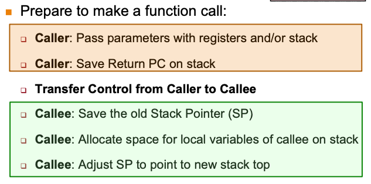
    -   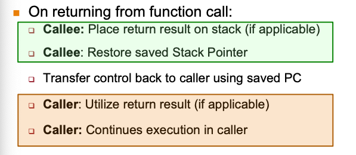
-   Frame pointer
    -   To facilitate the access of various stack frame items
    -   Points to a fixed location in a stack frame
-   Saved register
    -   Number of general purpose registers on most processors are limited
    -   When GPRs are exhausted, use memory to hold the GPR value, then reuse GPR, value held can be restored afterwards (known as register spilling)

#### Dynamically Allocated Memory

-   Acquire new memory space during execution time - malloc()
-   Observations
    -   Memory is allocated only at runtime (size is not known during compilation) -> cannot place in data region
    -   No definite deallocation timing (can be explicitly freed by programmer) -> cannot place in stack region
-   Solution: set up a separate heap memory region
-   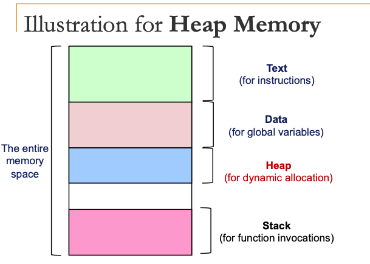
-   Memory context: text, data, stack and heap
-   Hardware context: general purpose register, program counter, stack pointer, stack frame pointer

### OS Context

#### Processes

-   Process Identification & Process States
    -   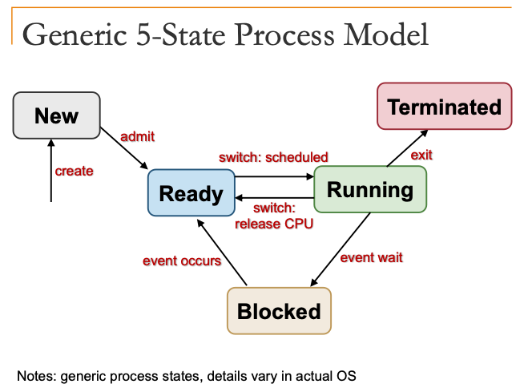

1. New
    - New process created
    - May still be under initialisation
2. Ready
    - Process is waiting to run
3. Running
    - Process being executed on CPU
4. Blocked
    - Process waiting for event
    - Cannot execute until event is available
5. Terminated
    - Process has finished execution, may require OS cleanup

-   Process Table & Process Control Block:

    -   Entire execution context for a process
    -   Kernel maintains PCB for all processes
    -   Hardware context in PCB is updated only when process swap out
    -   Memory context in PCB is not the actual memory space used in process (points to real memory & contains page table)
    -   PCBs are part of OS memory space
    -   OS context of PCB contains information used for scheduling, e.g. priority, time quantum allocated, etc.

-   System calls

    -   System calls are dependent on the operating system
    -   Application program interface (API) to OS
        -   Provides way of calling facilities/ services in kernel
        -   Not the same as normal function call (have to change from user mode to kernel mode)

    1. User program invokes the library call (normal function call, which are programming language dependent)
    2. Library call (usually in assembly code) places the system call number in a designated location E.g. Register
    3. Library call executes a special instruction to switch from user mode to kernel mode (commonly known as TRAP)
    4. Now in kernel mode, the appropriate system call handler is determined:
        - Using the system call number as **index**
        - This step is usually handled by a **dispatcher**
    5. System call handler is executed: Carry out the actual request
    6. System call handler ended:
        - Control return to the library call
        - Switch from kernel mode to user mode
    7. Library call return to the user program: via normal function return mechanism

    -   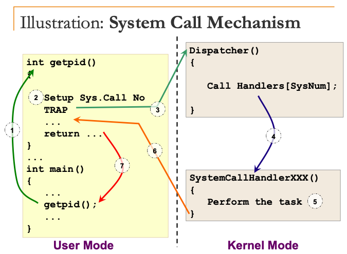
    -   System calls are more expensive than library calls due to context switching

-   Exception and Interrupt
    -   Exception is **synchronous**: occur due to program execution
        -   Have to execute an exception handler
        -   Similar to a forced function call
    -   Interrupt is **asynchronous**: events that occur independent of program execution
        -   Program execution is suspended
        -   Have to execute an interrupt handler
    -   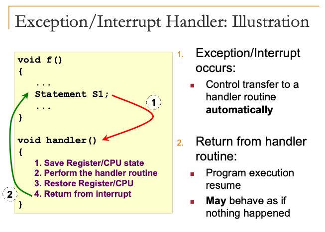

## Process Abstraction in Unix

-   Identification
    -   PID: process ID
-   Information
    -   Process state: running, sleeping, stopped, zombie
    -   Parent PID
    -   Cumulative CPU time
    -   Command: `ps` (process status)
-   Creation:
    -   `fork()`
        -   `# include <unistd.h>`
        -   `int fork();`
        -   Returns: PID of newly created process for parent and 0 for child
        -   Child process is a duplicate of current executable image
        -   Both parent and child processes continue executing after `fork()`
    -   `exec()`
        -   Replace current executing process image with a new one
        -   `# include <unistd.h>`
        -   `int execl( const char *path, const char *arg0 ... NULL)`
        -   Path: location of executable
        -   e.g. `execl( "/bin/ls", "ls", "-l", NULL);` = `ls -l`
-   Termination
    -   `#include <stdlib.h>`
    -   `void exit( int status );`
    -   0 = Normal Termination (successful execution)
    -   No return
    -   Most system resources used by processes are released on exit (files)
    -   Some resources are not releaseable (PID & status, process accounting info)
-   Parent-Child Synchronisation
    -   `#include <sys/types.h> #include <sys/wait.h>`
    -   `int wait( int *status );`
    -   Returns the PID of the terminated child process status (passed by address)
    -   Parent process blocks until at least one child terminates
-   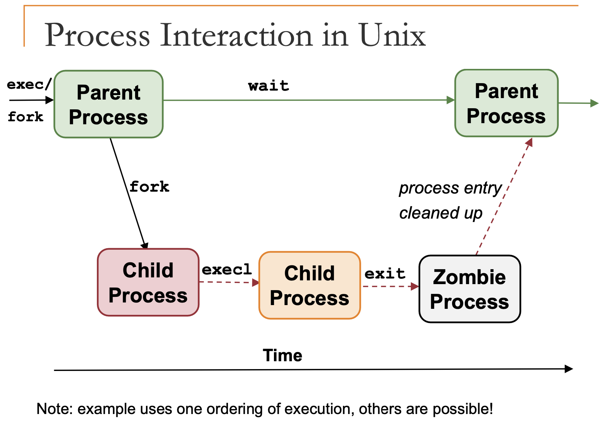
-   `wait()` creates zombie processes

### Zombie Process

-   Parent process terminates before child process:
    -   init process becomes "pseudo" parent of child processes
    -   Child termination sends signal to init, which utilizes wait() to cleanup
-   Child process terminates before parent but parent did not call wait:
    -   Child process become a zombie process
    -   Can fill up process table
    -   May need a reboot to clear the table on older Unix implementations

### Unix System Calls

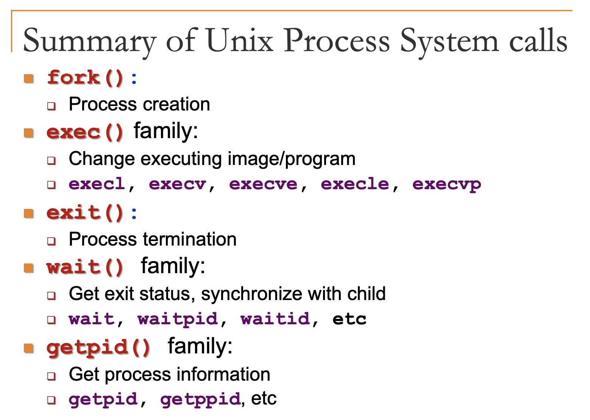

## Process Scheduling

-   Time quantum is always an integer multiple of interval between timer interrupt
-   Given the same period of time, smaller interval between timer interrupt lengthen task turn-around time
    -   Shorter ITI -> More Timer Interrupt -> less time spent on actual user process

### Concurrent Execution

-   Concurrent processes
    -   Logical concept to cover multitasked processes
    -   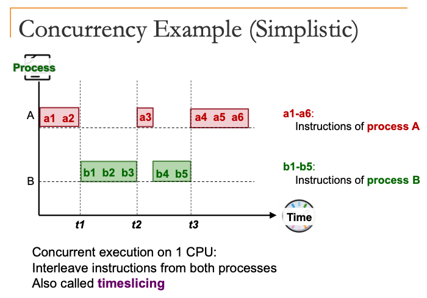
    -   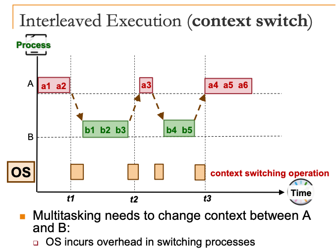
-   Terminology
    -   Scheduler: Part of the OS that makes scheduling decision
    -   Scheduling algorithm: The algorithm used by scheduler
-   Processing environment
    -   Batch processing
        -   No user: no interaction required, no need to be responsive
    -   Interactive
        -   With active user interacting with system
        -   Should be responsive, consistent in response time
    -   Real time processing
        -   Have deadline to meet
        -   Usually periodic process
-   Criteria for all processing environments
    -   Fairness
        -   Should get a fair share of CPU time
        -   No starvation
    -   Balance
        -   All parts of computing system should be utilised
-   Types of scheduling policies
    -   Non-preemptive (cooperative)
        -   A process stayed scheduled in running state until it blocks or gives up the CPU voluntarily
    -   Preemptive
        -   A process is given a fixed time quota to run (possible to block or give up early)

### Process Scheduling Algorithms

-   Criteria for batch processing
    -   **Turnaround time**: Total time taken, i.e. finish-arrival time
    -   **Waiting time**: Time spent waiting for CPU
    -   **Throughput**: Number of tasks finished per unit time i.e. Rate of task completion
    -   **CPU utilization**: Percentage of time when CPU is working on a task

#### First-Come First-Serve: FCFS

-   Tasks are stored on a First-In-First-Out (FIFO) queue based on arrival time
-   Pick the first task in queue to run until the task is done OR the task is blocked
-   Blocked task is removed from the FIFO queue
    -   When it is ready again, it is placed at the back of queue
    -   i.e. just like a newly arrive task
-   Guaranteed to have no starvation:
    -   The number of tasks in front of task X in FIFO is always decreasing -> task X will get its chance eventually
-   Shortcomings
    -   **Convoy effect**: FCFS algorithm is non-preemptive in nature, that is, once CPU time has been allocated to a process, other processes can get CPU time only after the current process has finished

#### Shortest Job First: SJF

-   Select task with the smallest total CPU time
-   Need to know total CPU time for a task in advance
-   Given a fixed set of tasks, average waiting time is minimised
-   Starvation is possible: biased towards short jobs, such that long job may never get a chance
-   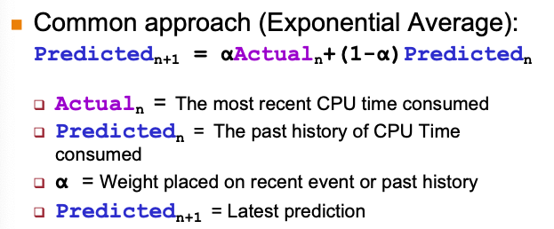

#### Shortest Remaining Time: SRT

-   Select job with shortest remaining (or expected) time
-   New job with shorter remaining time can preempt currently running job
-   Provide good service for short job even when it arrives late

#### Round Robin: RR

-   Tasks are stored in a FIFO queue
-   Pick the first task from queue front to run until:
    -   A fixed time slice (quantum) elapsed
    -   The task gives up the CPU voluntarily
-   The task is then placed at the end of queue to wait for another turn
    -   Blocked task will be moved to other queue to wait for its request
-   Basically a preemptive version of FCFS
-   Response time guarantee:
    -   Given n tasks and quantum q
    -   Time before a task get CPU is bounded by (n-1)q
-   Timer interrupt needed:
    -   For scheduler to check on quantum expiry
-   The choice of time quantum duration is important:
    -   Big quantum: Better CPU utilization but longer waiting time
    -   Small quantum: Bigger overhead (worse CPU utilization) but shorter waiting time

#### Priority Scheduling

-   Assign a priority value to all tasks, select task with highest priority value
-   Variants
    -   Preemptive version: higher priority process can preempt running process with lower priority
    -   Non-preemptive version: late coming high priority process has to wait for next round of scheduling
-   Shortcomings
    -   Low priority process can starve (worse in preemptive variant)
-   Possible solutions
    -   Decrease the priority of currently running process after every time quantum
    -   Give the current running process a time quantum
-   **Priority Inversion**: Priority inversion is a situation that can occur when a low-priority task is holding a resource such as a semaphore for which a higher-priority task is waiting

#### Multi-level Feedback Queue (MLFQ)

-   If Priority(A) > Priority(B) -> A runs
-   If Priority(A) == Priority(B) -> A and B runs in RR
-   Priority Setting/Changing rules:
    1. New job -> Highest priority
    2. If a job fully utilized its time slice -> priority reduced
    3. If a job give up / blocks before it finishes the time slice -> priority retained
-   Favours IO intensive process
-   Exploitations:
    -   Change of heart: A process with a lengthy CPU-intensive phase followed by I/O-intensive phase. The process can sink to the lowest priority during the CPU intensive phase. With the low priority, the process may not receive CPU time in a timely fashion, which degrades the responsiveness.
        -   Timely boost: All processes in the system will be moved to the highest priority level periodically.
        -   By periodically boosting the priority of all processes (essentially treat all process as “new” and hence have highest priority), a process with different behavior phases may get a chance to be treated correctly even after it has sunk to the lowest priority.
    -   Gaming the system: A process repeatedly gives up CPU just before the time quantum lapses.
        -   Accounting matters: The CPU usage of a process is now accumulated across time quanta. Once the CPU usage exceeds a single time quantum, the priority of the task will be decremented.

#### Lottery Scheduling

-   Give out “lottery tickets” to processes for various system resources
-   When a scheduling decision is needed, a lottery ticket is chosen randomly among eligible tickets
-   Responsive: a newly created process can participate in the next lottery
-   A process can be given Y lottery tickets to distribute to its child process
-   An important process can be given more lottery tickets
-   Each resource can have its own set of tickets
    -   Different proportion of usage per resource per task

### Scheduling for Interactive Systems

-   Criteria for Interactive Environment

    -   **Response time**: Time between request and response by system
    -   **Predictability**: Variation in response time, lesser variation -> more predictable
    -   Preemptive scheduling algorithms are used to ensure good response time
        -   Scheduler needs to run periodically

-   Interval of timer interrupt (ITI)
    -   OS scheduler is triggered every timer interrupt
-   Time Quantum
    -   Execution duration given to a process
    -   Could be constant or variable among the processes
    -   Must be multiples of interval of timer interrupt
    -   Large range of values

## Process Alternative - Threads

### Motivation for Thread

-   Process is expensive:
    -   Process creation under the fork() model: duplicate memory space, duplicate most of the process context etc
    -   Context switch: Requires saving/restoration of process information
-   It is hard for independent processes to communicate with each other:
    -   Independent memory space -> no easy way to pass information
    -   Requires Inter-Process Communication (IPC)
-   Thread is invented to overcome the problems with process model
    -   Started out as a "quick hack" and eventually matured to be very popular mechanism
-   Basic Idea:
    -   A traditional process has a single thread of control: only one instruction of the whole program is executing at any time
    -   Add more threads of control to the same process: multiple parts of the programs is executing at the same time conceptually

### Process and Thread

-   A single proces can have multiple threads: multithreaded process
-   Threads in the same process shares
    -   Memory context: text, data, heap
    -   OS context: process id, files
-   Unique information needed for each thread
    -   Identification (usually thread id)
    -   Registers (general purpose and special)
    -   Stack
-   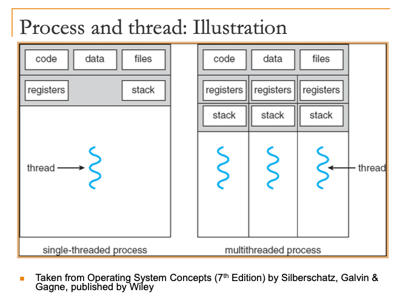
-   Context Switch
    -   Process context switch involves:
        -   OS Context
        -   Hardware Context
        -   Memory Context
    -   Thread switch within the same process involves:
    -   Hardware context: Registers, "Stack" (actually just changing FP and SP registers)
-   Threads: Benefits
    -   Economy
        -   Multiple threads in the same process requires much less resources to manage compared to multiple processes
    -   Resource sharing
        -   Threads share most of the resources of a process
        -   No need for additional mechanism for passing information around
    -   Responsiveness
        -   Multithreaded programs can appear much more responsive
    -   Scability
        -   Multithreaded program can take advantage of multiple CPUs
-   Threads: Problems
    -   System call concurrency
        -   Parallel execution of multiple threads -> parallel system call possible
    -   Process behaviour
        -   fork() duplicate process, and thread behaviour is OS specific (the other threads may or may not get duplicated)
        -   If a single thread calls exit() in a multithreaded program, it typically terminates the entire process, not just the thread that called exit()
        -   When a single thread calls exec(), it replaces the entire process image with a new program. This includes all threads. The new program starts with a single thread, and the previous threads of the calling process are terminated

### Thread Models

#### User Thread

-   Thread is implemented as a user library; kernel is not aware of the threads in the process
-   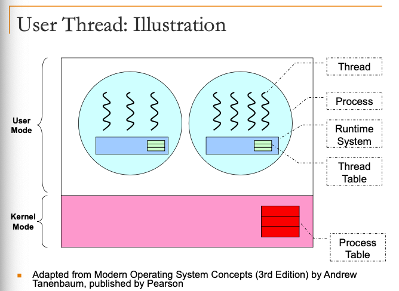
-   Advantages:
    -   Can have multithreaded program on ANY OS
    -   Thread operations are just library calls
    -   Generally more configurable and flexible
        -   e.g. Customized thread scheduling policy
-   Disadvantages:
    -   OS is not aware of threads, scheduling is performed at process level (can never exploit multi-core processors)
    -   One thread blocked -> Process blocked -> All threads blocked
    -   Cannot exploit multiple CPUs!

#### Kernel Thread

-   Thread is implemented in the OS
    -   Thread operation is handled as system calls
-   Thread-level scheduling is possible
    -   Kernel schedule by threads, instead of by process
-   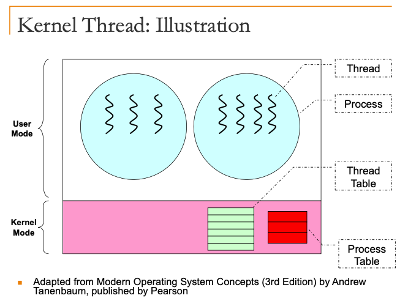
-   Advantages:
    -   Kernel can schedule on thread levels:
        -   More than 1 thread in the same process can run simultaneously on multiple CPUs
-   Disadvantages:
    -   Thread operations is now a system call!
        -   Slower and more resource intensive
    -   Generally less flexible:
        -   Used by all multithreaded programs
        -   If implemented with many features, expensive, overkill for simple program
        -   If implemented with few features, not flexible enough for some programs

#### Hybrid Thread Model

-   Have both kernel and user threads
    -   OS schedule on kernel threads only
    -   User thread can bind to a kernel thread
-   If we use a 1-to-1 binding in a hybrid thread model, the end result is the same as a pure kernel-thread model as each user thread is bounded to a kernel thread that can be scheduled
-   Offer great flexibility
    -   Can limit the concurrency of any process/ user

#### POSIX Threads: `pthread`

-   Header file: `# include <pthread.h>`
-   Compilation: `gcc XXX.c -lpthread`
-   Datatypes
    -   `pthread_t`: Data type to represent a thread id
    -   `pthread_attr`: Data type to represent attributes of a thread
-   Creation syntax
    -   Returns (0 = success; !0 = errors)
    -   Parameters:
        -   tidCreated: Thread Id for the created thread
        -   threadAttributes: Control the behavior of the new thread
        -   startRoutine: Function pointer to the function to be executed by thread
        -   argForStartRoutine: Arguments for the startRoutine function
-   Pthread can start on any function as long as the function signature is void* f(void*)

```c
int pthread_create(
    pthread_t* tidCreated,
    const pthread_attr_t* threadAttributes,
    void* (*startRoutine) (void*),
    void* argForStartRoutine );
```

-   Termination syntax
    -   Parameters:
        -   exitValue: Value to be returned to whoever synchronize with
            this thread (more later)
    -   If pthread_exit()is not used, a pthread will terminate
        automatically at the end of the startRoutine

```c
    int pthread_exit( void* exitValue );
```

-   Join
    -   To wait for the termination of another pthread
    -   Returns (0 = success; !0 = errors)
    -   Parameters:
        -   threadID: TID of the pthread to wait for
        -   status: Exit value returned by the target pthread

```c
    int pthread_join( pthread_t threadID, void **status );
```

## Inter-Process Communication (IPC)

-   General Idea:
    -   Process P1 creates a shared memory region M
    -   Process P2 attaches M to its own memory space
    -   P1 and P2 can now communicate using M
    -   Any writes to M can be seen by all other parties (behaves similar to normal memory region)
    -   Same model for multiple processes sharing the same memory region

```

Process P1

1. Create M (implict attach)
2. Read/Write to M

```

```

Process P2

1. Attach M
2. Read/Write to M

```

-   Master program

```c
int main() {
    int shmid, i, *shm;

    // Create shared memory region
    shmid = shmget( IPC_PRIVATE, 40, IPC_CREAT | 0600);

    if (shmid == -1) {
        printf("Cannot create shared memory!\n"); exit(1);
    } else
        printf("Shared Memory Id = %d\n", shmid);

    // Attach shared memory region
    shm = (int*) shmat( shmid, NULL, 0 );
    if (shm == (int*) -1) {
        printf("Cannot attach shared memory!\n");
        exit(1);
    }

    // First element is used as control value
    shm[0] = 0;

    while(shm[0] == 0) {
        sleep(3);
    }

    for (i = 0; i < 3; i++){
        printf("Read %d from shared memory.\n", shm[i+1]);
    }

    // Detach and destroy shared memory region
    shmdt( (char*) shm);
    shmctl( shmid, IPC_RMID, 0);
    return 0;
}
```

-   Slave program

```c
//similar header files
int main() {
    int shmid, i, input, *shm;

    printf("Shared memory id for attachment: ");
    scanf("%d", &shmid);

    // Attach to shared memory region
    shm = (int*)shmat( shmid, NULL, 0);
    if (shm == (int*)-1) {
        printf("Error: Cannot attach!\n");
        exit(1);
    }

    // Write 3 values
    for (i = 0; i < 3; i++){
        scanf("%d", &input);
        shm[i+1] = input;
    }

    // Let master program know we are done!
    shm[0] = 1;

    // Detach shared memory region
    shmdt( (char*)shm );
    return 0;
}
```

-   Advantages
    -   Efficient: only create and attach involve OS
    -   Ease of use: shared memory region behaves the same as normal memory
-   Disadvantages
    -   Synchronisation: shared resource means there is a need to synchronise access

### Message Passing

-   Process P1 prepares a message M and send it to Process P2
-   Process P2 receives the message M
-   Message sending and receiving are usually provided as system calls

-   Naming scheme
    -   Direct communication
        -   Sender/ receiver of message explicitly name the other party
    -   Indirect communication
        -   Messages are sent to/ received from message storage
-   Synchronisation behaviours
    -   Blocking primitives (synchronous)
        -   Sender/ receiver is blocked until message is received/ arrived
    -   Non-blocking primitives (asynchronous)
        -   Sender: resume operation immediately
        -   Receiver: either receive the message or some indication that message is not ready
-   Advantages
    -   Portable: can be easily implemented
    -   Easier synchronisation
-   Disadvantages
    -   Inefficient (requires OS intervention)
    -   Harder to use, messages are limited in size or format

### Unix Pipes

-   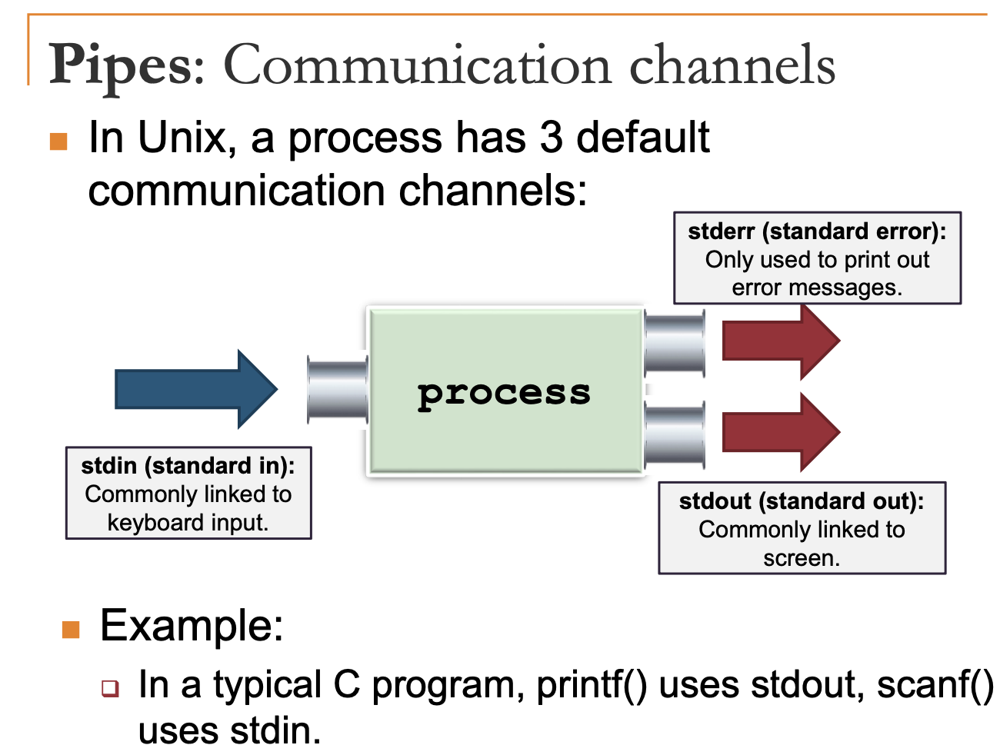
-   Piping in shell
    -   "|" symbol to link the input/output channels of one process to another (known as piping)
    -   Output of a process goes directly into another as input
-   Pipe functions as circular bounded byte buffer with implicit synchronization:
    -   Writers wait when buffer is full
    -   Readers wait when buffer is empty
-   Variants
    -   Half-duplex: unidirectional, one write end and one read end
    -   Full-duplex: bidirectional, read/ write for both ends
-   System calls
    -   `#include <unistd.h>`
    -   `int pipe( int fd[] )`
    -   Returns 0 to indicate success; !0 for errors

### Unix Signal

-   A form of inter-process communication
    -   An asynchronous notification regarding an event
    -   Sent to a process/thread
-   Recipient of the signal must handle the signal by
    -   A default set of handlers
    -   User supplied handler
-   E.g. kill, stop, continue, memory error, arithmetic error
-   A process can install user-define handler for multiple different signals.
    -   [True]
-   We can install user-define handler for all signals.
    -   [False: The "kill -9" i.e. SIGKIL is not captureable]
-   A parent process can force the child processes to execute any part of their code by sending signal to them.
    -   [False: Only the signal handler can be triggered.]
-   The "kill" signal (sent by the "kill" command) is different from the "interrupt" signal (sent by pressing "ctrl-c").
    -   [True]

## Synchronization

-   Designate code segment with race condition as critical section
-   At any point in time, only one process can execute in the critical section
-   Properties of correct critical section implementation:
    -   Mutual exclusion: Only one process can enter critical section
    -   Progress: If no process is in critical section, one of the waiting processes should be granted access
    -   Bounded wait: After process pi requests to enter critical section, there exists an upperbound of number of times other processes can enter the critical section before pi
    -   Independence: Process not executing in critical section should never block other process
-   Incorrect synchonization:
    -   Deadlock: All processes blocked
    -   Livelock: Processes keep changing state to avoid deadlock and make no other progress
    -   Starvation: Some processes are blocked forever
-   Implementations overview:
    -   Assembly level implementations: mechanisms provided by the processor
    -   High level language implementations: utilizes only normal programming constructs
    -   High level abstraction: provide abstracted mechanisms that provide additional useful features

### Assembly Level Implementation

-   `TestAndSet Register, MemoryLocation`
    -   Load the current content at MemoryLocation into Register
    -   Stores a 1 into MemoryLocation
    -   Performed as a single machine operation (i.e. atomic)
-   It employs **busy waiting** (keep checking the condition until it is safe to enter critical section)

### High Level Language Implementation

-   Peterson's Algorithm
    -   Keep a `turn` variable, so process can only run when it is their turn
    -   Keep a `Want` array, so process can only run if they want
    -   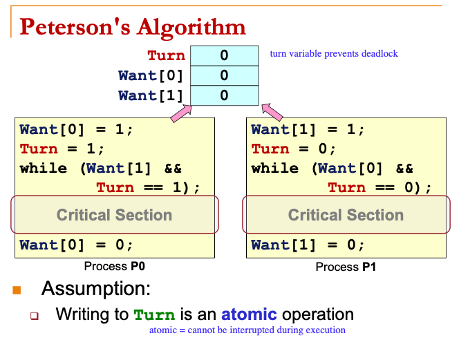
-   Disadvantages
    -   Busy waiting
    -   Low level: more error prone

### High Level Abstraction

-   Semaphore
    -   A generalized synchronization mechanism
    -   Only behaviours are specified
    -   Provides
        -   A way to block a number of processes, known as sleeping process
        -   A way to unblock/ wake up one or more sleeping process
-   Wait(S) (called before a process enters critical section)
    -   If S <= 0, blocks processes (go to sleep)
    -   Decrement S
-   Signal(S) (called after a process exits critical section)
    -   Increments S
    -   Wakes up one sleeping process if any
-   This usage is commonly known as mutex (mutual exclusion)
-   Properties
    -   Given S initial >= 0
    -   Invariant: S current = S initial + number of signals() operations executed - number of wait() operations completed

### Classical Synchronization Problems

-   Producer consumer
    -   Processes share a bounded buffer of size K
    -   Producers produce items to insert into buffer
    -   Consumers remove items from buffer
    -   Busy waiting
        -   while !canProduce, producer waits
        -   while !canConsumer, consumer waits
    -   Blocking version
        -   wait(notFull): producers go to sleep
        -   wait(notEmpty): consumers to go to sleep
        -   signal(notFull): 1 consumer wakes 1 producer
        -   signal(notEmpty): 1 producer wakes 1 consumer
-   Readers writers
    -   Processes share a data structure D
    -   Readers retrieve information from D
        -   If they are the first reader, wait for roomEmpty
        -   If they are the last reader, signal roomEmpty and release mutex
    -   Writer modifies information in D (when roomEmpty)
    -   Writer might face starvation if rate of arrival of readers > rate of departure of readers (so number of readers never reach 0)
-   Dining philosophers
    -   Tanenbaum solution
    -   To eat, a philosopher must acquire both the left and right chopsticks
    -   If a philosopher cannot acquire both chopsticks, they wait until both are available

### Synchronization Implementations

-   POSIX semaphore
    -   `#include <semaphore.h>`
    -   Initialize a semaphore
    -   Perform wait() or signal() on semaphore
-   pthread mutex and conditional variables
    -   Synchronization mechanisms for pthreads
    -   Mutex (pthread_mutex):
        -   Binary semaphore (i.e. equivalent Semaphore(1))
        -   Lock: pthread_mutex_lock()
        -   Unlock: pthread_mutex_unlock()
    -   Conditional Variables( pthread_cond ):
        -   Wait: pthread_cond_wait()
        -   Signal: pthread_cond_signal()
        -   Broadcast: pthread_cond_broadcast()

## Memory Abstraction

-   Types of data in a process
    -   Transient Data:
        -   Valid only for a limited duration, e.g., during function call
        -   e.g., parameters, local variables
    -   Persistent Data:
        -   Valid for the duration of the program unless explicitly removed (if applicable)
        -   e.g., global variable, constant variable, dynamically allocated memory
-   If two processes are using the same physical memory, there might be conflicts in memory access because both processes assume memory starts at 0
    -   Use logical adddress
    -   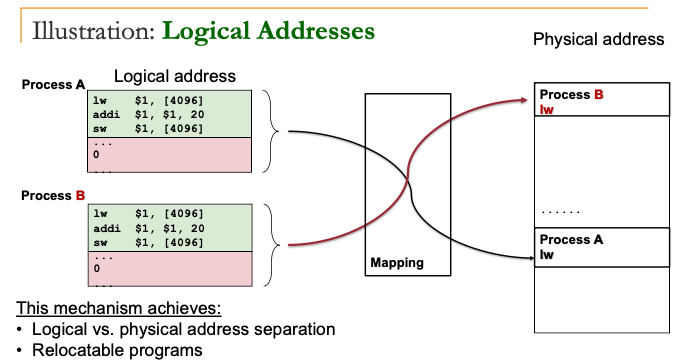

### Contiguous Memory Management

-   Assumptions
    -   Each process occupies a contiguous memory region
    -   Physical memory is large enough to contain one or more processes with complete memory space

#### Memory Partitioning

-   Fixed-Size Partitions
    -   Physical memory is split into fixed number of partitions of equal size
    -   A process will occupy one of the partitions
    -   Causes internal fragmentation (space leftover within partition when process takes less than partition size)
-   Variable-Size Partitions
    -   Partition is created based on the actual size of process
    -   OS keep track of the occupied and free memory regions
    -   Causes external fragmentation from removing processes
    -   Can use a linked list (takes more time) to move occupied partitions and create larger holes
-   Allocation algorithm
    -   First-fit
        -   Take the first hole that is large enough
    -   Next-fit
        -   Search from the last allocated block and wrap around
    -   Best-fit
        -   Find the smallest hole that is large enough
    -   Worst-fit
        -   Find the largest hole
    -   Buddy system
        -   Free block is split into half repeatedly to meet request size
        -   The two halves forms a sibling blocks (buddy blocks)
        -   When buddy blocks are both free, they can be merged to form larger block
        -   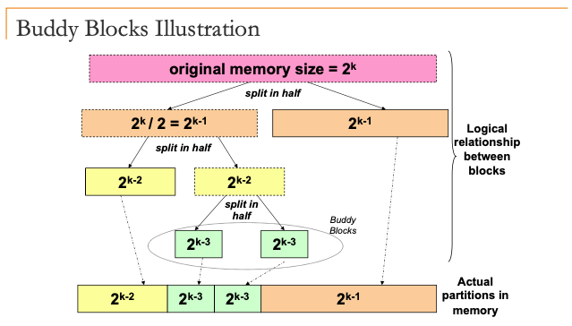

## Disjoint Memory Schemes

### Paging

-   Physical memory is split into regions of fixed size (known as physical frames)
-   Logical memory is similarly split into regions of the same size (logical page)
-   Lookup table to provide translation between logical page to physical page (page table)
-   Physical address = frame_number x sizeof(physical_frame) + offset
    -   Offset: displacement from the beginning of the physical frame
-   Address translation formula
    -   Page/Frame size of 2^n
    -   m bits of logical address
    -   **Frame number** represented by (m - n) bits
    -   **Offset** represented by n bits
    -   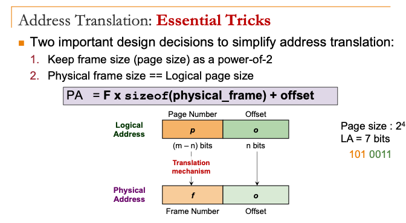
-   To store the page table,
    -   PCB (only software)
        -   Requires 2 memory accesses for every memory reference
    -   Translation Look-Aside Buffer (TLB)
        -   On-chip component to support paging
        -   TLB hit: Frame number is retrieved to generate physical address
        -   TLB miss: memory access to access the page table
-   When context switch occurs, TLB entries are flushed
    -   New process will not get incorrect translation

#### Protection

-   Access-Right Bits
    -   Each page table entry has a writable, readable, executable bit
    -   Every memory access is checked against the access right bits in hardware
-   Valid Bit
    -   Included in each page table entry
    -   Indicated whether the page is valid to access by the process
    -   Every memory access is checked against this bit in hardware:
        -   Out-of-range access will be caught by OS in this manner

#### Page Sharing

-   Several processes to share the same physical memory frame
    -   Use the same physical frame number in the page table entries
-   Implementing Copy-On-Write
    -   Parent and child process can share a page until one tries to change a value in it
-   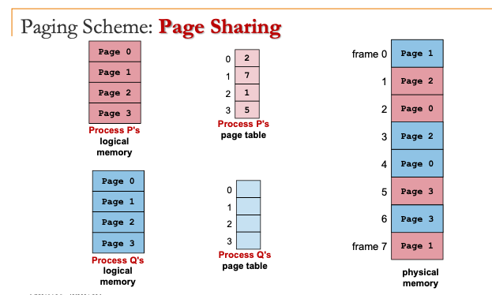

### Segmentation Scheme

-   Manage memory at the level of memory segments
-   Each memory segment
    -   Has a name
    -   Has a limit
-   Memory references specified as "segment name + offset"
-   Logical address translation
    -   Each segment mapped to a contiguous physical memory region with a base address and a limit/size
    -   Logical address `<SegID, Offset>`
    -   SegID is used to look up <Base, Limit> of the segment in a segment table
    -   Physical address = base + offset
    -   Offset < limit for valid access
-   Each segment is an independent contiguous memory space
-   Segmentation requires variable-size contiguous memory regions (can cause external fragmentation)

#### Segmentation with Paging

-   Each segment is composed of several pages instead of a contiguous memory region
-   

## Virtual Memory Management

-   Secondary storage capacity >> Physical memory capacity
-   Some pages are accessed much more often than others
-   Basic idea: split the logical address space into small chunks (some are in physical memory, others in secondary storage)

### Extended Paging Scheme

-   Use page table for virtual -> physical address translation
-   Two page types:
    -   Memory resident (pages in physical memory)
    -   Non-memory resident (pages in secondary storage)
    -   Use a resident bit in the page-table entry
-   CPU can only access memory resident pages
    -   If attempt to access non-resident, page fault

Hardware

1. Check page table:

    - Is page X a memory resident?
    - Yes: Access physical memory location. Done.
    - No: raise an exception!

OS

2. Page Fault: OS takes control
3. Locate page X in secondary storage
4. Load page X into a physical memory
5. Update page table
6. Go to step 1 to re-execute the same instruction
    - This time with the page in memory

### Issues

-   Secondary storage access time >> physical memory access time
-   If memory access results in page fault most of the time
    -   To load non-resident pages into memory
    -   Entire system can slow down significantly (known as thrashing)
-   Locality principles
    -   Temporal Locality:
        -   Memory address used now is likely to be used again
    -   Spatial Locality:
        -   Memory addresses close to the address that is used now is likely to be used soon
-   Demand paging
    -   Process start with no memory resident page
    -   Only allocate a page when there is a page fault
    -   Fast startup time for new process
    -   Might be sluggish at the start due to page faults
