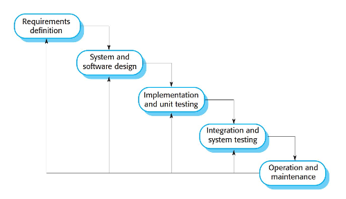
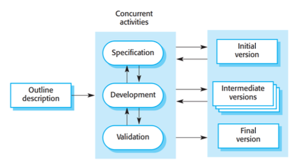
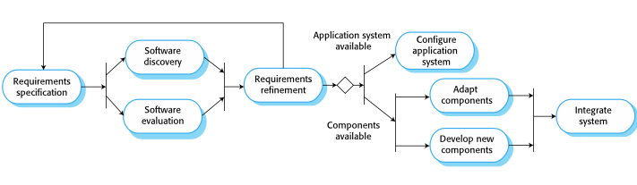
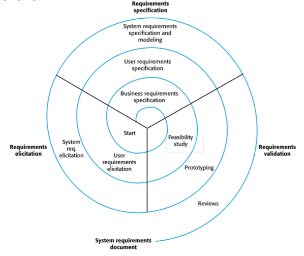

# CS3213 Notes AY23/24 Sem2

## Software Engineering

-   “Software engineering is an **engineering discipline** that is concerned with all aspects of software production from initial conception to operation and maintenance.” (Sommerville)
    -   Engineering is about selectively using theories, methods, and tools where appropriate
-   No silver bullet (1986)
    -   Fred Brooks 1931-2022
    -   “There is no single development, in either technology or in management technique, that itself promises even **one order-of-magnitude improvement** in productivity, in reliability, in simplicity.”
    -   “I believe the hard part of building software to be the specification, design, and testing of this conceptual construct, not the labor of representing it and testing the fidelity of the representation. [...] If this is true, **building software will always be hard**. There is inherently no silver bullet.”

### Software Engineering Activities

Central software engineering activities:

-   Software specification
    -   The functionality of the software and contraints on its operation must be defined
-   Software development
    -   The software to meet the specification must be produced
-   Software validation
    -   The software must be validated to ensure it does what the customer wants
-   Software evolution
    -   The software must evolve to meet changing customer needs

Two general perspectives:

-   Plan-based development
    -   Requirements engineering --> requirements specification --> design and implementation --(requirements change requests)--> requirements engineering
-   Agile development
    -   Requirements engineering --> design and implementation --> requirements engineering

### Software Process Models

-   Software process model: simplified representation of a software process
-   Typically from one perspective (eg activities, but no people and their roles)

#### Waterfall Model

-   
-   Plan-driven model: plan and schedule before starting development
-   Next phase only starts after previous one completed
-   Works well if requirements are clear, large safety-critical software systems
-   Drawback:
    -   Accomodating change (e.g. changing requirements)

#### Incremental Development

-   
-   Interleaves the activities of specification, development, and validation
-   System is developed as a series of versions (increments), with each version adding functionality to the previous version
-   Cost of accommodating change and responding to changing customer requirements is lower
-   More rapid delivery of software
-   Plan-driven (e.g., in combination with prototyping) or agile
-   Drawback
    -   Process is less measurable; degrading system structure (refactoring required)

#### Prototyping

-   Developing executable model of the system
-   Requirements engineering: can help with the elicitation and validation of system requirements
-   System design: can be used to explore software solutions and in the development of a user interface for the system

#### Integration and Configuration

-   

## Requirements Engineering

-   Requirements: Descriptions of the services that a system should provide and the constraints on its operation.
-   Reflect the needs of customers for a system that serves a certain purpose such as controlling a device, placing an order, or finding information.
-   Requirements engineering (RE): Process of finding out, analyzing, documenting and checking these services and constraints
-   Stakeholders: Person or organization who influences a system’s requirements or who is impacted by that system.
-   Problems:
    -   Users' incomplete understanding of needs, computer capabilties and limitations
    -   Conflicting views from different users
    -   Requirements evolve over time
-   Reasons for requirements engineering:
    -   Lowest defect cost
    -   High cost of errors during requirements
    -   Communication between stakeholders for customer relation and communication
    -   Basis for structure and behaviour of software design
    -   Basis for testing and acceptance of final product
    -   Dictate the quality of the system realisation, risks and overhead in operations

### Software Requirements Documents

-   Or Software Requirements Specification (SRS)
-   Goal of requirements definition
-   May include both the user requirements for a system and a detailed specification of the system requirements
-   Requirements change rapidly in agile methods: requirements are written incrementally as user stories

### Requirements

-   User requirements: statements of what services the system is expected to provide to system users and the constraints under which it must operate
-   System requirements: more detailed descriptions of the software system’s functions, services, and operational constraints
    -   Document (or functional specification) should define exactly what is to be implemented
    -   May be part of the contract between the system buyer and the software developers
-   Functional: describe what the system should do
    -   Should be complete and consistent
-   Non-functional: requirements that are not directly concerned with the specific services delivered by the system to its users
    -   Often more critical than individual functional requirements
    -   Whenever possible, they should be written quantitatively so they can be objectively tested
-   Key activities:
    -   Elicitation and analysis: discovering requirements by interacting with the stakeholders
    -   Specification: converting the requirements into a standard form
    -   Validation: checking that the requirements actually define the system that the customer wants
-   
    -   High level business requirements --> detailed system requirements

### Elicidation and Analysis

-   Challenges:
    -   Stakeholders often do not know what they want from a computer system except in the most general terms
    -   They may make unrealistic demands because they do not know what is and is not feasible.
    -   Political factors may influence the requirements of a system. Managers may demand specific system requirements because these will allow them to increase their influence in the organization.
    -   Economic and business environment in which the analysis takes place is dynamic. It inevitably changes during the analysis process.

## Software Architecture

## System Modeling

## Agile Software Development
