# CS3213 Notes AY23/24 Sem2

-   [CS3213 Notes AY23/24 Sem2](#cs3213-notes-ay2324-sem2)
    -   [Software Engineering](#software-engineering)
        -   [Software Engineering Activities](#software-engineering-activities)
        -   [Software Process Models](#software-process-models)
            -   [Waterfall Model](#waterfall-model)
            -   [Incremental Development](#incremental-development)
            -   [Prototyping](#prototyping)
            -   [Integration and Configuration](#integration-and-configuration)
    -   [Requirements Engineering](#requirements-engineering)
        -   [Software Requirements Documents](#software-requirements-documents)
        -   [Requirements](#requirements)
        -   [Elicidation and Analysis](#elicidation-and-analysis)
        -   [Requirements Specification](#requirements-specification)
            -   [Natural Language](#natural-language)
        -   [Use Cases and User Stories](#use-cases-and-user-stories)
        -   [Requirements Validation](#requirements-validation)
        -   [Basis for Testing](#basis-for-testing)
        -   [Requirements Management Planning](#requirements-management-planning)
    -   [Software Architecture](#software-architecture)
        -   [Architectural Drivers](#architectural-drivers)
            -   [Advantages of Architectural Design](#advantages-of-architectural-design)
        -   [Architectural Patterns](#architectural-patterns)
        -   [Quality Attributes](#quality-attributes)
            -   [Availability Tactics](#availability-tactics)
    -   [System Modeling](#system-modeling)
        -   [Modeling Languages](#modeling-languages)
            -   [UML](#uml)
            -   [C4](#c4)
            -   [Business Process Model and Notation (BPMN)](#business-process-model-and-notation-bpmn)
    -   [Agile Software Development](#agile-software-development)
        -   [Agile Manifesto](#agile-manifesto)
        -   [Agile Reasons](#agile-reasons)
        -   [Scrum](#scrum)
        -   [Kanban](#kanban)
        -   [Extreme Programming](#extreme-programming)
    -   [Quality Assurance: Software Testing](#quality-assurance-software-testing)
        -   [Testing Levels](#testing-levels)
        -   [Test Flakiness](#test-flakiness)
        -   [Testing and Processes](#testing-and-processes)
        -   [Automated Testing Approaches](#automated-testing-approaches)
    -   [Software Evolution](#software-evolution)

## Software Engineering

-   “Software engineering is an **engineering discipline** that is concerned with all aspects of software production from initial conception to operation and maintenance.” (Sommerville)
    -   Engineering is about selectively using theories, methods, and tools where appropriate
-   No silver bullet (1986)
    -   Fred Brooks 1931-2022
    -   “There is no single development, in either technology or in management technique, that itself promises even **one order-of-magnitude improvement** in productivity, in reliability, in simplicity.”
    -   “I believe the hard part of building software to be the specification, design, and testing of this conceptual construct, not the labor of representing it and testing the fidelity of the representation. [...] If this is true, **building software will always be hard**. There is inherently no silver bullet.”

### Software Engineering Activities

Central software engineering activities:

-   Software specification
    -   The functionality of the software and contraints on its operation must be defined
-   Software development
    -   The software to meet the specification must be produced
-   Software validation
    -   The software must be validated to ensure it does what the customer wants
-   Software evolution
    -   The software must evolve to meet changing customer needs

Two general perspectives:

-   Plan-based development
    -   Requirements engineering --> requirements specification --> design and implementation --(requirements change requests)--> requirements engineering
-   Agile development
    -   Requirements engineering --> design and implementation --> requirements engineering

### Software Process Models

-   Software process model: simplified representation of a software process
-   Typically from one perspective (eg activities, but no people and their roles)

#### Waterfall Model

-   
-   Plan-driven model: plan and schedule before starting development
-   Next phase only starts after previous one completed
-   Works well if requirements are clear, large safety-critical software systems
-   Drawback:
    -   Accomodating change (e.g. changing requirements)

#### Incremental Development

-   
-   Interleaves the activities of specification, development, and validation
-   System is developed as a series of versions (increments), with each version adding functionality to the previous version
-   Cost of accommodating change and responding to changing customer requirements is lower
-   More rapid delivery of software
-   Plan-driven (e.g., in combination with prototyping) or agile
-   Drawback
    -   Process is less measurable; degrading system structure (refactoring required)

#### Prototyping

-   Developing executable model of the system
-   Requirements engineering: can help with the elicitation and validation of system requirements
-   System design: can be used to explore software solutions and in the development of a user interface for the system

#### Integration and Configuration

-   

## Requirements Engineering

-   Requirements: Descriptions of the services that a system should provide and the constraints on its operation.
-   Reflect the needs of customers for a system that serves a certain purpose such as controlling a device, placing an order, or finding information.
-   Requirements engineering (RE): Process of finding out, analyzing, documenting and checking these services and constraints
-   Stakeholders: Person or organization who influences a system’s requirements or who is impacted by that system.
-   Problems:
    -   Users' incomplete understanding of needs, computer capabilties and limitations
    -   Conflicting views from different users
    -   Requirements evolve over time
-   Reasons for requirements engineering:
    -   Lowest defect cost
    -   High cost of errors during requirements
    -   Communication between stakeholders for customer relation and communication
    -   Basis for structure and behaviour of software design
    -   Basis for testing and acceptance of final product
    -   Dictate the quality of the system realisation, risks and overhead in operations

### Software Requirements Documents

-   Software Requirements Specification (SRS)
-   Goal of requirements definition
-   May include both the user requirements for a system and a detailed specification of the system requirements
-   Requirements change rapidly in agile methods: requirements are written incrementally as user stories

### Requirements

-   User requirements: statements of what services the system is expected to provide to system users and the constraints under which it must operate
-   System requirements: more detailed descriptions of the software system’s functions, services, and operational constraints
    -   Document (or functional specification) should define exactly what is to be implemented
    -   May be part of the contract between the system buyer and the software developers
-   Functional: describe what the system should do
    -   Should be complete and consistent
-   Non-functional: requirements that are not directly concerned with the specific services delivered by the system to its users
    -   Often more critical than individual functional requirements
    -   Whenever possible, they should be written quantitatively so they can be objectively tested
-   Key activities:
    -   Elicitation and analysis: discovering requirements by interacting with the stakeholders
    -   Specification: converting the requirements into a standard form
    -   Validation: checking that the requirements actually define the system that the customer wants
-   
    -   High level business requirements --> detailed system requirements

### Elicidation and Analysis

-   Challenges:
    -   Stakeholders often do not know what they want from a computer system except in the most general terms
    -   They may make unrealistic demands because they do not know what is and is not feasible.
    -   Political factors may influence the requirements of a system. Managers may demand specific system requirements because these will allow them to increase their influence in the organization.
    -   Economic and business environment in which the analysis takes place is dynamic. It inevitably changes during the analysis process.
-   Process Model

    -   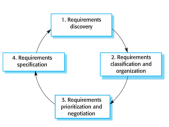

        1. Process of interacting with stakeholders to discover requirements
        2. Groups related requirements and organises them into coherent clusters
            - One way of doing so is to consider each group to be a viewpoint and collect all requirements from that group into that viewpoint
        3. Priorising requirements and resolving requirements conflicts
        4. Requirements are documented and input into the next round of the spiral

-   Elicidation Methods:
    -   Interviewing
        -   Closed interview: stakeholder answers a predefined set of questions
        -   Open interviews: no predefined agenda. The requirements engineering team explores a range of issues with system stakeholders and hence develops a better understanding of their needs
    -   Document analysis (prior research)
    -   Workshops
    -   Focus groups
    -   Prototyping
    -   Observation (of how people work)
-   Personas: an archetype of a user group

### Requirements Specification

-   User Requirements
    -   Almost always written in natural language supplemented by appropriate diagrams and tables in the requirements document
    -   Should describe the functional and nonfunctional requirements so that they are understandable by system users who do not have detailed technical knowledge
    -   Should specify only the external behavior of the system
    -   Should not include details of the system architecture or design
-   System Requirements
    -   May also be written in natural language, but other notations based on forms, graphical, or mathematical system models can also be used
    -   Expanded versions of the user requirements that software engineers use as the starting point for the system design
    -   Add detail and explain how the system meets user requirements
    -   May be used as part of the contract for the implementation of the system
    -   Should be a complete and detailed specification of the whole system
    -   Should only describe the external behavior of the system and its operational constraints
    -   Should not be concerned with how the system should be designed or implemented.

#### Natural Language

-   Invent a standard format and ensure that all requirement definitions adhere to that format.
-   Use text highlighting (bold, italic, or color) to pick out key parts of the requirement.
-   Avoid the use of jargon, abbreviations, and acronyms.

### Use Cases and User Stories

-   User-centric view to elicit and specify requirements both common in the traditional view and for agile methods
-   Focus on what users need to accomplish (i.e., the tasks they expect the system to do for them)
-   Use case
    -   Describes an interaction between an actor and the system
    -   Documented as a high-level use case diagram
    -   Set of use cases represents all of the possible interactions that will be described in the system requirements
-   User story
    -   Serve as a placeholder that will be split into smaller stories for implementation; elaborate to acceptance tests called “conditions of satisfaction”

### Requirements Validation

-   Process of checking that requirements define the system that the customer really wants
-   Feasibility study
    -   A short, focused study that should take place early in the RE process
-   System prototyping
    -   A version of the system or part of the system is developed quickly to check the customer’s requirements and the feasibility of design decisions
-   Peer review
    -   Someone else than the author of the document reviews the requirements
-   Informal review
    -   Collecting unstructured feedback
-   Formal requirements review
    -   Requirements are analyzed systematically by a team of reviewers who check for errors and inconsistencies
-   Inspection
    -   Reviewing one requirement at a time, and noting down defects
    -   Validity checks: requirements reflect the real needs of system users
    -   Consistency checks: requirements in the document should not conflict
    -   Completeness checks: requirements document should include requirements that define all functions and constraints intended
    -   Realism checks: can be implemented within proposed budget
    -   Verifiability: reduce the potential for dispute between customer and contractor

### Basis for Testing

-   Requirements should be testable and used to derive test cases
-   Test-driven development
-   V-model and testing
    -   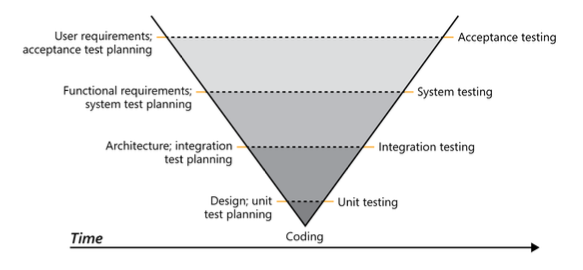

### Requirements Management Planning

-   Concerned with establishing how a set of evolving requirements will be managed
-   Requirements identification:
    -   Each requirement must be uniquely identified
    -   So it can be cross-referenced with other requirements and used in traceability assessments
-   A change management process:
    -   Set of activities that assess the impact and cost of changes
-   Traceability policies:
    -   Define the relationships between each requirement and between the requirements and the system design that should be recorded
-   Tool support:
    -   Range from specialist requirements management systems to shared spreadsheets and simple database systems

## Software Architecture

-   How the system is organized (e.g., components and relations)
-   How developers explain the system at a high level (i.e., the overall structure)
-   Architectural pattern: established architectural solution that might comprise multiple architectural tactics
    -   Design pattern: typically less relevant for architecture (e.g., Factory Pattern or Facade)
-   Architectural tactic: design decision that influences a quality attribute

### Architectural Drivers

-   Architecturally significant requirements (ASRs): requirements that have a measurable impact on the architecture
-   Representing as
    -   Block diagram: box as component, arrow as data/ control flow
    -   [UML](https://ruishanteo.github.io/cheatsheets/cs2103t/cs2103t-notes/#uml)
    -   [C4](https://en.wikipedia.org/wiki/C4_model)
        -   Context diagrams (level 1): show the system in scope and its relationship with users and other systems
        -   Container diagrams (level 2): decompose a system into interrelated containers. A container represents an application or a data store
        -   Component diagrams (level 3): decompose containers into interrelated components, and relate the components to other containers or other systems
        -   Code diagrams (level 4): provide additional details about the design of the architectural elements that can be mapped to code. The C4 model relies at this level on existing notations like UML
-   Structures
    -   Component-and-connector (C&C) structures: focuses on the way components interact with each other at run time
    -   Module structures: focuses on how to partition systems into implementation units (modules like packages, classes, layers)
        -   Decomposition structure: shows how modules are related to each other by the “is-a-submodule-of” relation
        -   Uses structure: focuses on a “uses” relation, where unit requires another unit for its correct functioning
        -   Generalization structure: focus on classes and their relationships, “Inherits-from” or “is-an-instance-of” relation
    -   Allocation structures: focuses on how software maps to non-software structures, such as its organizations

#### Advantages of Architectural Design

1. Quality Attributes
    - Whether or not a system meets its quality attributes (i.e., non-functional requirements) is significantly influenced by its architecture
2. Modifiability and Reasoning about Change
    - Modifiability is a quality attribute, but one of the most common and
      important ones
    - Three categories of changes
        - Local change: only single component is affected (e.g., adding a new rule to a pricing module)
        - Non-local change: multiple elements are affected (e.g., besides the rule, database and UI needs to be changed)
        - Architectural change: affects how the elements interact and might require changes over the whole system
3. Communication Among Stakeholders
    - Can be used as a basis for mutual understanding, negotiating, forming consensus, and communicating with each other

### Architectural Patterns

-   Typically comprise multiple architectural tactics
-   Big ball of mud
    -   An antipattern: lack of architecture
-   Layered architecture
    -   A layer can only use the layer directly beneath it
    -   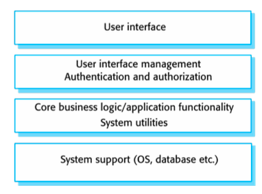
    -   Quality attributes:
        -   Modifiability: separation allows changes to be localized
        -   Portability: allows layers to be general or specific to an OS or environment
        -   Reusability
-   Monoliths: Layered and Modular
    -   Often used to distinguish the architecture from a distributed architecture (e.g., microservices)
    -   Typically a single deployable unit
    -   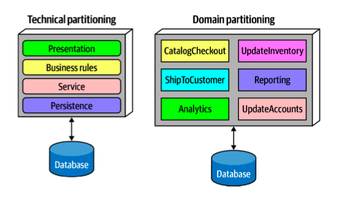
    -   Layered: technical partitioning
    -   Modular: partitioned by domains or workflows
-   Pipe-and-filter architecture
    -   Pipe: data as input and output
    -   Filters incrementally read their input, process it, and incrementally write it to their output
    -   Data flows through the pipes: transformed, filtered, or enriched
    -   Quality attributes:
        -   Modifiability: filters are independent from each other
        -   Reconfigurability: filters can be combined in different ways
-   Model-centered

    -   Independent components interact with a central model (also known as repository style) rather than with each other
    -   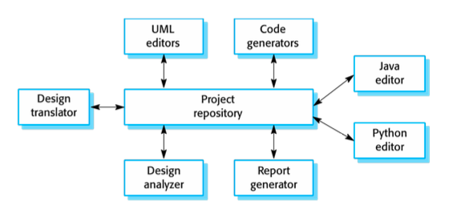
    -   Quality attributes:
        -   Modifiability
        -   Extensibility
    -   Model View Controller (instantiation of a model-centered architecture)
        -   Three components
            -   Model: model like in other model-centered architecture
            -   Controller: for user interaction, updates the model
            -   View: renders the presentation of the model
        -   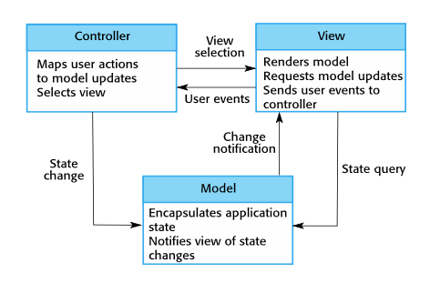
        -   Quality attributes:
            -   Highly modifiable: Components are independent, can be added; state can be managed and persisted since it is centralized
            -   Concurrency: Views and controllers can run in their own threads or processes

-   Microkernel (plug-in architecture)
    -   Natural fit for many products that are installed as a single, monolithic deployment
    -   Each subsystem in the platform is itself structured as a set of plug-ins that implement some key function
    -   Quality attributes:
        -   Extensibility
        -   Maintainability
        -   Testability
-   Client-server
    -   Clients request services from the server
    -   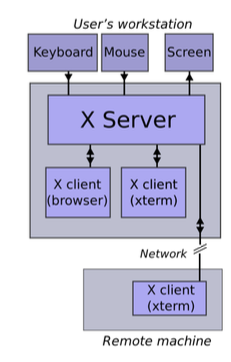
    -   Quality attributes:
        -   Maintainability: organizations can change a business process or rule by changing the implementation of the server (rather than all the individual clients)
        -   Evolvability
-   Service-oriented
    -   Focus on independent (domain) services that are separately deployed
    -   Quality attributes:
        -   Deployability: services can be individually managed
        -   Testability: services can be individually tested
        -   Reliability: if one service goes down, others might be able to continue
-   Microservice
    -   Primary goal is decoupling: microservices are expected to be independent
        -   Each microservice models a domain or workflow
    -   Quality attributes:
        -   Quick time to market and Deployability
        -   Independence: each team can make its own technology choices
        -   Scalability: service instances can be dynamically added

### Quality Attributes

1. Source
    - Specifies where the fault comes from
    - Internal/ external: people, hardware, software
2. Stimulus
    - Cause of fault
    - Omission, crash, incorrect timing
3. Artifact
    - Which portions of the system are responsible for and affected by the fault
    - Processors, communication channels, storage
4. Environment
    - Running environment and environment that is recovering from a fault
    - Normal operation, startup, shutdown, overloaded operation, repair mode
5. Response
    - Most commonly desired response is to prevent the fault from becoming a failure
6. Response Measure
    - Focus on a number of measures of availability, depending on the criticality of the service being provided
    - Time to detect the fault, time to repair the fault

#### Availability Tactics

-   Detect faults
    -   Monitor: monitor various components of the system
    -   Heartbeat: periodic message exchange between a system monitor and a process being monitored
    -   Sanity checking: checks the validity of specific operations or their output based on the knowledge of their internal structure
-   Recover (Preparation and repair)
    -   **Redundant spare**: one or more duplicate components can step in if a component fails
    -   **Rollback**: revert to a previous, known good state
    -   **Software upgrade**: in-service upgrade in a non-service-affecting manner
-   Recover (Reintroduction)
    -   **Shadow**: operate a component in a "shadow mode" while being mentored before revering it back to an active mode
    -   **Escalating restart**: automatic restart at different granularities (clear caches/ restart the whole system)
-   Prevent faults
    -   **Removal from service**
    -   **Transactions**: Provide atomic, consistent, isolated and durable properties
    -   **Increase competence set**: set of states in which the program can "competently" operate

## System Modeling

-   Goal: develop abstract models of a system
-   Perspectives:
    -   External perspective: context or environment of the system
    -   Interaction perspective: interactions between a system and its environment, or between the components of a system
    -   Structural perspective: model the organization of a system or the structure of the data that is processed by the system
    -   Behavioral perspective: model the dynamic behavior of the system and how it responds to events

### Modeling Languages

-   [UML](https://ruishanteo.github.io/cheatsheets/cs2103t/cs2103t-notes/#uml), C4, Business Process Model and Notation (BPMN), Systems modeling language (SysML)

#### UML

-   Sequence diagrams focus on objects in a system, whereas activity diagrams focus on operations or activities
-   State machine diagram
    -   Show how the system reacts to internal and external events
    -   Example of a behavioral model (like activity diagrams)
    -   Focus on system states and events that cause transitions from one state to another
-   Use case diagram
    -   Shows interactions between actors and system
-   Class diagrams: show the object classes in the system and the associations between these classes
-   Sequence diagrams: show interactions between actors and the system and between system components
-   Activity diagrams: show the activities involved in a process or in data processing

#### C4

-   Developed for modeling for software architectures
-   Hierarchical diagrams and abstractions
    -   System context: a System Context diagram provides a starting point, showing how the software system in scope fits into the world around it
    -   Containers: a Container diagram zooms into the software system in scope, showing the high-level technical building blocks
    -   Components: a Component diagram zooms into an individual container, showing the components inside it
    -   Code: A code (e.g. UML class) diagram can be used to zoom into an individual component, showing how that component is implemented

#### Business Process Model and Notation (BPMN)

-   For business processes, similar to UML activity diagrams
-   Related standard: Decision Model and Notation (DMN)
    -   Means deriving a result (output) from given facts (input) on the basis of defined logic (decision logic)
    -   Most popular way to model decisions: a decision table

## Agile Software Development

### Agile Manifesto

-   Individuals and interactions over processes and tools
-   Working software over comprehensive documentation
-   Customer collaboration over contract negotiation
-   Responding to change over following a plan
-   Satisfy the customer through early and continuous delivery of valuable software
-   Welcome changing requirements, even late in development
-   Delivery working software frequently

### Agile Reasons

-   Organisations' SE priorities:
    -   End-customer satisfaction
    -   Time to delivery
    -   Competitive advantage
-   Used for ongoing release cycles, featuring small incremental changes

### Scrum

-   General, lightweight framework
    -   Does not specify how to do requirements engineering, architecture, etc
-   Prescriptive: proposes specific rules that need to be followed
-   Often seen as a synonym to agile practices
-   Focus: delivering value
    -   Achieves this via increments in sprints
-   Founded on empiricism and lean thinking

    -   Empiricism: knowledge comes from experience and decision making based on observations
    -   Lean thinking: reduce waste and focus on the essentials

-   **Scrum pillars**

    -   Transparency: process and work is visible for those doing the work and receiving its output
    -   Inspection: artifact and process is inspected frequently to detect problems
    -   Adaption: adjustments if the resulting product is unacceptable

-   **Sprints**
    -   Goal: create a useful increment
    -   Includes planning, daily scrums, sprint review, sprint retrospective and product backlog
    -   Artifacts: product backlog (ordered list of what is needed to improve the product), sprint backlog (sprint goal, product backlog items selected for sprint, an actionable plan for delivering the increment), increment (concrete stepping point towards product goal)
-   User stories: describe some functionality and represent customer requirements
    -   Card: a written description of the story used for planinng
    -   Conversation: verbal exchange with the customer to flesh out the details of the story
    -   Confirmation: acceptance tests specified by the customer can be used to determine when a story is complete

### Kanban

-   Optimizes flow using a visual, pull-based system
-   Definition of Workflow (DoW): explicit shared understanding of flow, which requires a definition of various concepts
    -   A definition of how WIP will be controlled from started to finished
    -   A service level expectation (SLE), which is a forecast of how long it should take a work item to flow from started to finished

### Extreme Programming

-   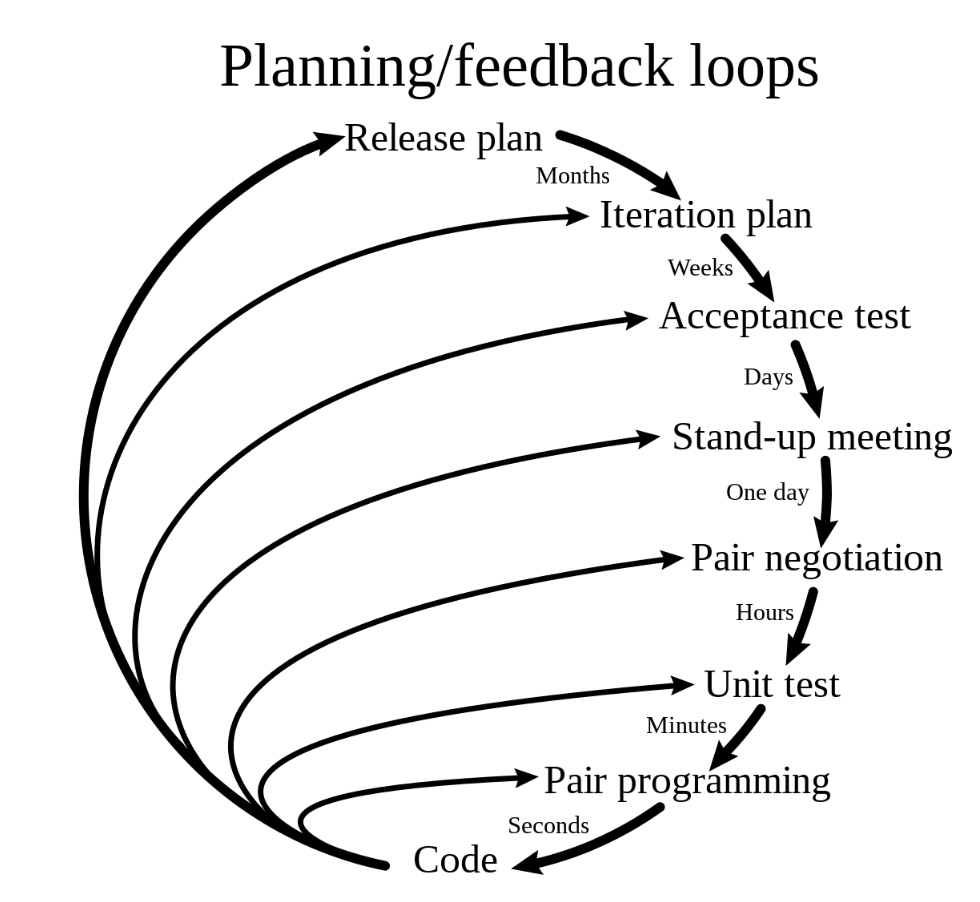
-   Extreme Programming (XP) takes an “extreme” approach to iterative development and best practices

    -   New versions may be built several times per day
    -   Increments are delivered to customers every 2 weeks
    -   All tests must be run for every build and the build is only accepted if tests run successfully

-   **Pair programming**
    -   All code is produced by two developers working together
    -   One developer is programming, while the other is reviewing and focusing on the big picture
-   **Test-driven development**
    -   XP proposed test-driven development
    -   Unit tests are written before the code is written
    -   Acceptance tests are derived from the user requirements
-   **Continuous integration**
    -   Development team should always work on the latest version of the software
    -   Code should be integrated into the main branch of the project frequently
-   On-site customer: A representative of the end-user of the system (the customer) should be available full time for the use of the XP team. In an extreme programming process, the customer is a member of the development team and is responsible for bringing system requirements to the team for implementation.
-   Sustainable pace: Large amounts of overtime are not considered acceptable as the net effect is often to reduce code quality and medium term productivity

## Quality Assurance: Software Testing

-   **Defect testing**: “program testing can be used very effectively to show the presence of bugs but never to show their absence” - Dijkstra
-   **Validation testing**: demonstrate that the system corresponds to the requirements
-   Verification: "are we building the product right"
    -   Programming errors
-   Validation: "are we building the right product"
    -   Whether this is what user requires
-   **Test Case**
    -   **Test Oracle**: is a mechanism for determining whether a test has passed or failed (e.g. `assertEquals`)
    -   Test input
-   Automated testing: testing tool automatically generates a test input and applies a test oracle
-   Manual test: manually testing for defects
-   Pesticide paradox: Every method you use to prevent or find bugs leaves a residue of subtler bugs against which those methods are ineffectual
    -   Not all bugs can be identified from one method of testing

### Testing Levels

-   Unit test: testing individual components
    -   Typically fast, and allow testing of large portions of a system in limited time
    -   Easy to control, as they typically check expected result values when passed a certain input value
    -   Easy to write, as they require no additional set up
    -   Lack reality, as they do not represent the real execution of a system
-   Integration test: testing multiple components in combination
    -   Typically focuses on "our" component and an external component (database system or web services)
-   System test (end-to-end test): evaluating the whole system
    -   Run the system in its entirety instead of testing small parts in isolation
    -   Realistic tests but are often slow and harder to write

### Test Flakiness

-   Flaky test: a test that might non-deterministically pass or fail
-   Lowers confidence in the tests, difficult to debug, might lower overall developer productivity
-   Causes:
    -   Concurrency, when task is shared by multiple threads
    -   Async wait: whether the test case succeeds depends on how quickly server responds
-   Test pyramid: write tests with different granularity (fewer high-level tests, many small and fast unit tests)

### Testing and Processes

-   Waterfall model
    -   
-   V-model
    -   Testing happens after requirements engineering, architecture, design phases
    -   Testing is planned together with other phases
    -   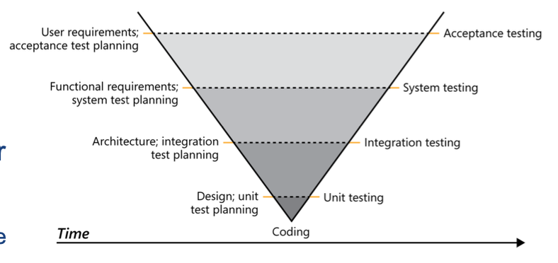
-   Acceptance testing
    -   User Acceptance Testing (UAT): focuses on validation, that is, checking whether the system meets the users’ requirements
-   Test driven development (TDD)
    -   Focus on requirements and quick feedback
    -   Used when faced with complex problem or solution not yet clear
    -   Classicist/ detroit school: inside-out TDD, start with different units that will compose the overall feature
    -   London school: outside-in TDD, start from the outside and use of mocking
    -   Steps
        -   Write test
        -   Check that the newly-written test fails
        -   Write the simplest code that passes the new test
        -   All tests should now pass
        -   Refactor as needed
-   Black-box: no internal information
    -   Specification-based testing, derives tests based on the requirements or documentation
-   White-box: internal information (based on a function's implementation)
    -   Use the source code to guide testing, known as structural testing
    -   Main means through coverage criteria
        -   Line: lines_covered / total lines x 100%
        -   Branch (each branching instruction): branches_covered / total branches x 100%
        -   Condition (multiple conditions like && || in one line) + branch: (branches_covered + conditions_covered) / (total_branches + total_conditions) x 100%
        -   Path: paths_covered / total_paths x 100%
        -   Modified condition/ decision coverage: number_of_conditions_evaluated_to_all_possible_outcomes_affecting_the_outcome_of_the_decision / total_number_of_conditions_within_the_decisions x 100%
        -   Test important combinations of conditions and thus reduce the cost as compared to full Path Coverage
        -   Each condition in a decision is shown to independently affect the outcome of the decision
        -   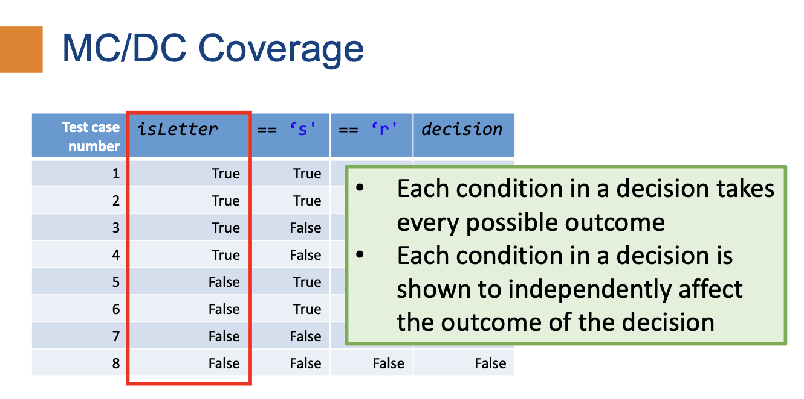
-   Exploratory testing
    -   Explore what the program does to increase your understanding and build a mental model
-   Devising test cases: boundary value analysis, identifying partitions
-   Mutation testing
    -   Evaluate the quality of exisiting tests and derive new tests
    -   Mutate code in the program (introduce a bug), assuming that a test case "kills" the mutant
    -   Effective way of discovering undertested parts

### Automated Testing Approaches

-   Automated testing tackles test input generation and/or test oracle problem

-   **Property-based testing**
    -   Specify properties for the component we can test and let the test framework find a test input that might cause the property to break
    -   Property-based testing framework: jqwik for Java
    -   Useful for complex functionality and if there is uncertainty whether example-based tests are sufficient
-   **Differential testing**
    -   Send a common input to multiple systems and see whether their result or other properties agree
    -   Compare between:
        -   Different versions of a software
        -   Different configurations
        -   Against a simple reference engine
        -   Different implementations of the same functionality
    -   Potentially small overlap in functionality and intended differences makes this technique produce false alarms that need to be analyzed
-   **Metamorphic testing**
    -   Use a source test-case (and its result) to generate a follow-up test case for which the result can be inferred
    -   Black-box approach
    -   Equivalence Modulo Inputs (EMI) is one of the most successful metamorphic testing approaches
        -   Rather than creating equivalent programs, create programs that are equivalent only for a given input, which is easier
-   Constraint Solvers
    -   Constraint solvers accept a formula and check if it is satisfiable (SAT) or unsatisfiable (UNSAT)
    -   Boolean Satisfiability (SAT Solvers)
        -   Input: propositional formula
        -   Output: model that satisfies the formula
    -   Satisfiability Modulo Theories (SMT Solvers)
        -   Solve a formula based on a given theory
-   **Symbolic Execution**
    -   Testing involves executing the program on one, concrete input
    -   Uses an SMT solver to determine whether a patch condition is feasible or not
    -   Systematically generate inputs (but there might be path explosion)
-   **Fuzzing**
    -   Black-box fuzzing: send random input to the program and hope it crashes
    -   Mutation-based fuzzing: Rather than passing random input to the program, mutate existing inputs
    -   White-box fuzzing: Leverages detailed knowledge of the program for fuzzing
    -   Grey-box fuzzing: For each mutated input, check whether it resulted in a gain of code coverage (or code coverage pattern)
-   Test-case Reduction: many automated input generation techniques generate large inputs
    -   Remove redundant test cases that do not trigger the bug
    -   Delta debugging\*: systematically removes elements from the bug-inducing input; Behaves like binary search but tries different combinations of smaller blocks where binary search fails
-   Small scope hypothesis: A high proportion of errors can be found by testing a program for all test inputs within some small scope
-   Static analysis tools are tools that reason about code without executing it
    -   Linters and style checkers
    -   Data-flow analysis
    -   Control-flow analysis
-   Completeness: If analysis says X is true, it is really true
-   Soundness: If X is true, the analysis will indicate that X is true

**\*Delta Debugging**
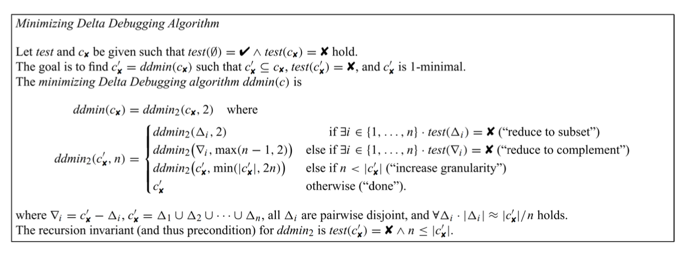
(with granularity n = 2)

1. Try to reduce to subset (use only either input 1 or input 2)
2. Try to reduce to complement (swap input 1 and 2)
3. If both result in no bug, increase granularity to n = 4 (have input 1, 2, 3, 4)
4. If input that fails the test is found, reduce granularity to n = 3
5. If still fails, reduce granularity again
6. If passes, increase granularity (find the local minimum)

## Software Evolution

-   **Versioning**
    -   Software versioning is the process of assigning either unique version names or unique version numbers to unique states of computer software
    -   Commit hash: automatically generated, but near random and may include irrelevant versions in-between
    -   Calendar versioning (YY.MM.DD.HH.mm)
    -   Semantic versioning (major version. minor version. patch version)
-   **Bug finding**
    -   Infrastructure software such as databases, compilers are depended on to build stable software
    -   Fuzz testing: tries to break infrastructure software by randomizing input
-   **Feature triage**
    -   Requirements elicitation changes after release
    -   Determine the usage and performance of software via analytics and telemetry
-   **Deprecation**
    -   Don't deprecate
        -   Backwards compatibility is a feature
        -   Early mistakes cannot be easily reversed
    -   Translation interface
        -   Adapt the old interface to call the new one, migration is blind to user
        -   Need to maintain old promises
        -   Hyrum's law: With a sufficient number of users of an API, it does not matter what you promise in the contract; all observable behaviors of your system will be depended on by somebody.
        -   With enough users, any change to a piece of software will break somebody's workflow
    -   Migration tooling
        -   Create a tool for stakeholders to automatically upgrade to the next version
        -   Tool needs to be created and tested
    -   End-of-support period
        -   Guarantee some support of old versions to give stakeholders time to migrate
        -   Someone needs to maintain the old version
    -   Advisory Deprecation
        -   Deprecations that have no deadline and are not a high priority for the organization
    -   Compulsory Deprecation
        -   Deprecations that have a deadline, after which the deprecated interface is no longer guaranteed to work
