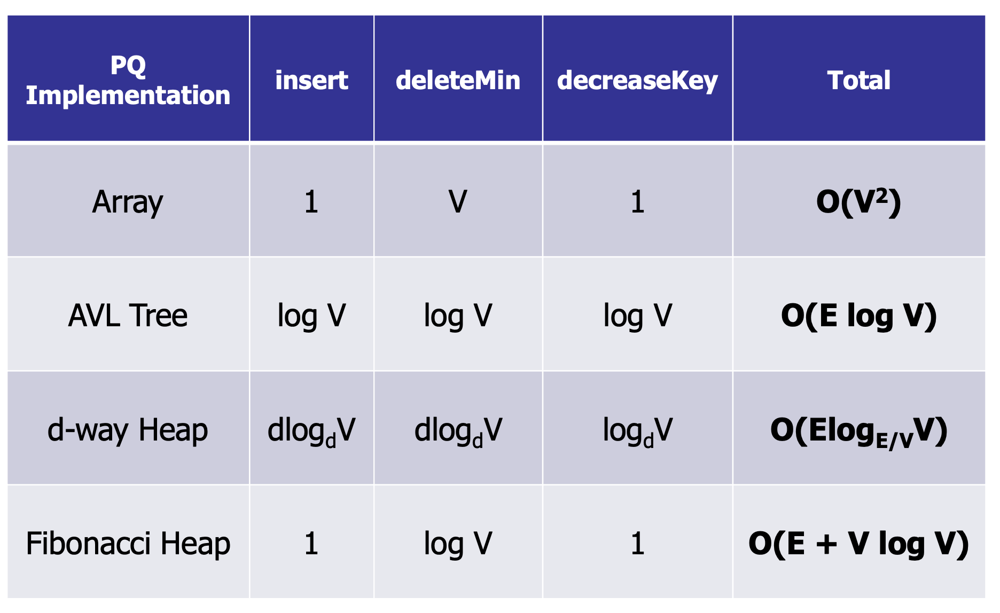

# Data Structures and Algorithm

-   [Data Structures and Algorithm](#data-structures-and-algorithm)
    -   [Recurrence Relations](#recurrence-relations)
    -   [Binary Search](#binary-search)
    -   [Peak Finding](#peak-finding)
    -   [Sorting](#sorting)
        -   [BubbleSort](#bubblesort)
        -   [SelectionSort](#selectionsort)
        -   [InsertionSort](#insertionsort)
        -   [MergeSort](#mergesort)
        -   [QuickSort](#quicksort)
            -   [Partition](#partition)
            -   [QuickSelect](#quickselect)
    -   [Trees](#trees)
        -   [Binary Search Trees](#binary-search-trees)
            -   [Height](#height)
            -   [Search](#search)
            -   [Insert](#insert)
        -   [Traversals](#traversals)
            -   [Inorder Traversal](#inorder-traversal)
            -   [Preorder Traversal](#preorder-traversal)
            -   [Postorder Traversal](#postorder-traversal)
        -   [Delete](#delete)
    -   [Balanced Trees](#balanced-trees)
        -   [AVL](#avl)
            -   [Insert](#insert-1)
            -   [Delete](#delete-1)
    -   [Tries](#tries)
    -   [Dynamic Order Statistics](#dynamic-order-statistics)
    -   [Interval Trees](#interval-trees)
        -   [Insert](#insert-2)
        -   [Interval Search](#interval-search)
    -   [1D Range Trees](#1d-range-trees)
        -   [Query](#query)
    -   [2D Range Trees](#2d-range-trees)
    -   [Priority Queue](#priority-queue)
        -   [Binary (Max) Heaps](#binary-max-heaps)
            -   [Insert](#insert-3)
            -   [DecreaseKey](#decreasekey)
            -   [Delete](#delete-2)
            -   [Heap vs AVL Tree](#heap-vs-avl-tree)
        -   [HeapSort](#heapsort)
    -   [Disjoint Set](#disjoint-set)
        -   [Quick Find: using an int\[\] componentId](#quick-find-using-an-int-componentid)
        -   [Quick Union: using an int\[\] parent](#quick-union-using-an-int-parent)
        -   [Weighted Union](#weighted-union)
        -   [Weighted Union with Path Compression](#weighted-union-with-path-compression)
    -   [Hashing](#hashing)
        -   [Direct Access Table](#direct-access-table)
        -   [Chaining](#chaining)
        -   [Open Addressing](#open-addressing)
        -   [Resizing Table](#resizing-table)
    -   [Graph](#graph)
        -   [Breadth-First Search](#breadth-first-search)
        -   [Depth-First Search](#depth-first-search)
    -   [Shortest Path](#shortest-path)
        -   [Bellman-Ford](#bellman-ford)
        -   [Dijkstra's Algorithm](#dijkstras-algorithm)
    -   [Minimum Spanning Trees](#minimum-spanning-trees)
        -   [Prim's Algorithm](#prims-algorithm)
        -   [Kruskal's Algorithm](#kruskals-algorithm)
    -   [Dynamic Programming](#dynamic-programming)

## Recurrence Relations

1. T(n) = T(n-1) + O(1) = O(n)
2. T(n) = T(n/2) + O(1) = O(logn)
3. T(n) = T(n-1) + O(n) = O(n^2)
4. T(n) = T(n-1) + O(nk) = O(n^(k+1))
5. T(n) = 2T(n/2) + O(n) = O(nlogn)
6. T(n) = T(n/2) + O(n) = O(n)
7. T(n) = 2T(n/2) + O(1) = O(n)
8. T(n) = 2T(n-1) + O(1) = O(2^n)

## Binary Search

-   Time complexity: O(logn)
-   Preconditions:
    -   Array is of size n
    -   Array is sorted
-   Postconditions:
    -   If element is in array: `A[left] = key`
-   Loop invariant:
    -   `A[left] <= key <= A[right]`
    -   (right - left) <= n/2^k in iteration k

```java
public int search(int A[], int key, int n) {
    int left = 0;
    int right = n - 1;

    while (left < right) {
        // int mid = (left + right) / 2 can lead to integer overflow
        int mid = left + (right - left) / 2;
        if (key <= A[mid]) {
            right = mid;
        } else {
            left = mid + 1;
        }
    }
    return (A[left] == key ? left : -1);
}
```

## Peak Finding

-   Output a local maximum in A, where A[i - 1] <= A[i] and A[i + 1] <= A[i]
-   Time complexity: O(logn)
-   Invariant:

    -   If we recuse in the right half, then there exists a peak in the right half
    -   There exists a peak in the range [begin, end]
    -   Every peak in [begin, end] is a peak in [1, n]

-   T(n) = T(n/2) + θ(1) = O(logn)

```java
public int findPeak(int A[], int n) {
    // if right of mid is larger, recurse on right
    if (A[n / 2 + 1] > A[n / 2]) {
        return findPeak(Arrays.copyOfRange(A, n / 2 + 1, n + 1), n / 2)
    // if left of mid is larger, recurse on left
    } else if (A[n / 2 - 1] >  A[n / 2]) {
        return findPeak(Arrays.copyOfRange(A, 0, n / 2), n / 2)
    } else {
        return n / 2;
    }
}
```

## Sorting

### BubbleSort

-   Invariant:
    -   At the end of iteration i, the biggest j items are correctly sorted in the final j positions of the array.
-   Best: O(n), when array is already sorted
-   Worst: **O(n^2)**, when array is reverse sorted
-   Stable
-   Description:
    -   For n loops, if A[j] > A[j + 1], swap(A[j], A[j + 1])
    -   

```java
void bubbleSort(int arr[], int n) {
    int i, j, temp;
    boolean swapped;
    for (i = 0; i < n - 1; i++) {
        swapped = false;
        for (j = 0; j < n - i - 1; j++) {
            if (arr[j] > arr[j + 1]) {

                // Swap arr[j] and arr[j+1]
                temp = arr[j];
                arr[j] = arr[j + 1];
                arr[j + 1] = temp;
                swapped = true;
            }
        }

        // If no two elements were
        // swapped by inner loop, then break
        if (swapped == false)
            break;
    }
}
```

### SelectionSort

-   Invariant:
    -   At the end of iteration j: the smallest j items are correctly sorted in the first j positions of the array.
-   Best: O(n^2)
-   Worst: **O(n^2)**
-   Not stable
-   Description:
    -   For n loops, find minimum element A[j] in A[j..n], swap(A[j], A[k])
    -   

```java
void selectionSort(int arr[], int n) {
    int min_idx = 0;

    // One by one move boundary of unsorted subarray
    for (int i = 0; i < n - 1; i++) {

        // Find the minimum element in unsorted array
        min_idx = i;
        for (int j = i + 1; j < n; j++) {
            if (arr[j] < arr[min_idx])
                min_idx = j;
        }

        // Swap the found minimum element with the first element
        if (min_idx != i)
            swap(arr[min_idx], arr[i]);
    }
}
```

### InsertionSort

-   Invariant:
    -   At the end of iteration j: the first j items in the array are in sorted order.
-   Best: O(n), when array is already sorted
-   Worst: **O(n^2)**, when array is reverse sorted
-   Stable
-   Description:
    -   For n loops, insert key into the sorted array A[1 .. j - 1]
    -   

```java
void insertionSort(int arr[]) {
    int n = arr.length;
    for (int i = 1; i < n; ++i) {
        int key = arr[i];
        int j = i - 1;

        /* Move elements of arr[0..i-1], that are
            greater than key, to one position ahead
            of their current position */
        while (j >= 0 && arr[j] > key) {
            arr[j + 1] = arr[j];
            j = j - 1;
        }
        arr[j + 1] = key;
    }
}
```

### MergeSort

-   Best: `O(n logn)`
-   Worst: `O(n logn)`
-   Stable
-   Memory: `O(n logn)`
-   Description:
    -   Divide: split array into two halves
    -   Recurse: sort the two halves
    -   Combine: merge the two sorted halves
    -   
-   Use InsertionSort instead for n < 1024

```java
void merge(int arr[], int l, int m, int r) {
    // Find sizes of two subarrays to be merged
    int n1 = m - l + 1;
    int n2 = r - m;

    // Create temp arrays
    int L[] = new int[n1];
    int R[] = new int[n2];

    // Copy data to temp arrays
    for (int i = 0; i < n1; ++i)
        L[i] = arr[l + i];
    for (int j = 0; j < n2; ++j)
        R[j] = arr[m + 1 + j];

    // Merge the temp arrays

    // Initial indices of first and second subarrays
    int i = 0, j = 0;

    // Initial index of merged subarray array
    int k = l;
    while (i < n1 && j < n2) {
        if (L[i] <= R[j]) {
            arr[k] = L[i];
            i++;
        }
        else {
            arr[k] = R[j];
            j++;
        }
        k++;
    }

    // Copy remaining elements of L[] if any
    while (i < n1) {
        arr[k] = L[i];
        i++;
        k++;
    }

    // Copy remaining elements of R[] if any
    while (j < n2) {
        arr[k] = R[j];
        j++;
        k++;
    }
}

void mergeSort(int arr[], int l, int r) {
    if (l < r) {
        // Find the middle point
        int m = l + (r - l) / 2;

        // Sort first and second halves
        mergeSort(arr, l, m);
        mergeSort(arr, m + 1, r);

        // Merge the sorted halves
        merge(arr, l, m, r);
    }
}
```

### QuickSort

-   Invariant:
    -   At the end of every loop iteration,
    -   For every i < low: B[i] < pivot
    -   For every j > high: B[j] > pivot
-   Best: `O(n logn)`, when median element is chosen as pivot
-   Worst: `O(n^2)`, when first element is chosen as pivot/ all elements are the same
-   Not stable
-   Description:
    -   
    -   Divide: Partition the array into two sub-arrays around a pivot x such that elements in lower subarray ≤ x ≤ elements in upper sub-array.
    -   Conquer: Recursively sort the two sub-arrays.
    -   Combine: Trivial, do nothing.

```java
void quickSort(int[] arr, int low, int high) {
    if (low < high) {

        // pi is partitioning index, arr[pi]
        // is now at right place
        int pi = partition(arr, low, high);

        // Separately sort elements before
        // partition and after partition
        quickSort(arr, low, pi - 1);
        quickSort(arr, pi + 1, high);
    }
}
```

#### Partition

-   Invariant:
    -   A[high] > pivot at the end of each loop
    -   At the end of every loop iteration
        -   For all i >= high, A[i] > pivot
        -   For all 1 < j < low, A[j] < pivot
-   Time complexity: `O(n)`

```java
int partition(int[] arr, int low, int high) {
    // Choosing the pivot
    int pivot = arr[high];

    // Index of smaller element and indicates
    // the right position of pivot found so far
    int i = (low - 1);

    for (int j = low; j <= high - 1; j++) {

        // If current element is smaller than the pivot
        if (arr[j] < pivot) {

            // Increment index of smaller element
            i++;
            swap(arr, i, j);
        }
    }
    swap(arr, i + 1, high);
    return (i + 1);
}
```

#### QuickSelect

-   Invariant:
    -   After partioning, arr[partition] is now at right place
-   Time complexity: `O(n)`
-   Description: Find the k-th smallest element in an unordered list
    -   partition the array
    -   if partition is at position k, the partition is the k-th smallest element
    -   else continue searching in the correct half

```java
// ASSUMPTION: all elements in arr[] are distinct
int kthSmallest(int[] arr, int low,
                            int high, int k) {
    // find the partition
    int partition = partition(arr, low, high);

    // if partition value is equal to the kth position, return value at k
    if (partition == k - 1) {
        return arr[partition];
    }
    // if partition value is less than kth position, search right side of the array
    else if (partition < k - 1) {
        return kthSmallest(arr, partition + 1, high, k);
    }
    // if partition value is more than kth position, search left side of the array
    else {
        return kthSmallest(arr, low, partition - 1, k);
    }
}
```

## Trees

### Binary Search Trees

-   All in left sub-tree < key < all in right sub-tree

#### Height

-   Number of edges on longest path from root to leaf
-   `h(v) = 0` (if v is a leaf)
-   `h(v) = max(h(v.left), h(v.right)) + 1`
-   Time complexity: `O(logn)`

```java
int height() {
    int leftHeight = -1;
    int rightHeight = -1;

    if (leftTree != null) {
        leftHeight = leftTree.height();
    }
    if (rightTree != null) {
        rightHeight = rightTree.height();
    }
    return max(leftHeight, rightHeight) + 1;
}
```

#### Search

-   Worst case: `O(n)`, (when n = h)
-   Time complexity: `O(h)`

-   searchMax()

```java
TreeNode searchMax() {
    if (rightTree != null) {
        return rightTree.searchMax();
    } else {
        return this;
    }
}
```

-   searchMin()

```java
TreeNode searchMin() {
    if (leftTree != null) {
        return leftTree.searchMin();
    } else {
        return this;
    }
}
```

-   search(int queryKey)

```java
public TreeNode search(int queryKey){
    if (queryKey < key) {
        if (leftTree != null) {
            return leftTree.search(key);
        } else {
            return null;
        }
    } else if (queryKey > key) {
        if (rightTree != null) {
            return rightTree.search(key);
        } else {
            return null;
        }
    } else {
        return this; // Key is here!
    }
}
```

#### Insert

```java
void insert(int insKey, int intValue) {
    if (insKey < key) {
        if (leftTree != null) {
            leftTree.insert(insKey);
        } else {
            leftTree = new TreeNode(insKey,insValue)
        }
    } else if (insKey > key) {
        if (rightTree != null) {
            rightTree.insert(insKey);
        } else {
            rightTree = new TreeNode(insKey, insValue);
        }
    } else {
        return; // Key is already in the tree!
    }
}
```

### Traversals

#### Inorder Traversal

-   Left, self, right
-   Running time: `O(n)`

```java
void inOrder(Node node) {
    if (node == null)
        return;

    // First recur on left child
    inOrder(node.left);

    // Then print the data of node
    System.out.print(node.key + " ");

    // Now recur on right child
    inOrder(node.right);
}
```

#### Preorder Traversal

-   Self, left, right
-   Running time: `O(n)`

```java
void preOrder(Node node) {
    if (node == null)
        return;

    // Print the data of node
    System.out.print(node.key + " ");

    // Then recur on left child
    preOrder(node.left);

    // Now recur on right child
    preOrder(node.right);
}
```

#### Postorder Traversal

-   Left, right, self
-   Running time: `O(n)`

```java
void postOrder(Node node) {
    if (node == null)
        return;

    // First recur on left child
    postOrder(node.left);

    // Then recur on right child
    postOrder(node.right);

    // Now print the data of node
    System.out.print(node.key + " ");
}
```

### Delete

-   Successor
    -   Running time: `O(h)`
    -   Idea:
        1. Search for key in the tree.
        2. If (result > key), then return result.
        3. If (result <= key), then search for successor of result.
    -   Case 1: node has a right child
    -   Case 2: node has no right child

```java
public TreeNode successor() {
    if (rightTree != null) {
        return rightTree.searchMin();
    }
    TreeNode parent = parentTree;
    TreeNode child = this;
    while ((parent != null) && (child == parent.rightTree)) {
        child = parent;
        parent = child.parentTree;
    }
    return parent;
}
```

-   Delete
    -   Running time: `O(h)`
    -   Case 1: no children
        -   Remove v
    -   Case 2: 1 child
        -   Remove v
        -   Connect child(v) to parent(v)
    -   Case 3: 2 children
        -   x = successor(v)
        -   Delete(x)
        -   Remove v
        -   Connect x to left(v), right(v), parent(v)

## Balanced Trees

-   BST is balanced if `h = O(logn)`
-   All operations run in `O(logn)` time
-   Maxmimum height: `h < 2logn`
-   Mininimum nodes: `n > 2^(h/2)`

1. In every node v, store height (augment)

    - On insert and delete, update height: `height = max(left.height, right.height) + 1`

2. Define Invariant

    - A node v is **height-balanced** if `|v.left.height - v.right.height| <= 1`
    - A BST is height-balanced if every node is height-balanced

3. Maintain balance

```java
// assume v has left != null
void rightRotate(TreeNode v) {
    TreeNode w = v.left;
    w.parent = v.parent;
    v.parent = w;
    v.left = w.right;
    w.right = v;
}
```

```java
// assume v has right != null
void leftRotate(TreeNode v) {
    TreeNode w = v.right;
    w.parent = v.parent;
    v.parent = w;
    v.right = w.left;
    w.left = v;
}
```

If v is out of balanced and left-heavy:

-   Case 1: v.left is balanced -> rightRotate(v)
    
-   Case 2: v.left is left-heavy -> rightRotate(v)
    
-   Case 3: v.left is right-heavy -> leftRotate(v.left), rightRotate(v)
    
    

If v is out of balanced and right-heavy:

-   Case 1: v.right is balanced -> leftRotate(v)
-   Case 2: v.right is left-heavy -> leftRotate(v)
-   Case 3: v.right is right-heavy -> rightRotate(v.right), leftRotate(v)

```java
import java.util.TreeSet;

TreeSet<IntegerNode> leftHalf;
TreeSet<IntegerNode> rightHalf;

void rebalance() {
    int leftSize = this.leftHalf.size();
    int rightSize = this.rightHalf.size();

    int diff = Math.abs(leftSize - rightSize);
    if (diff > 1) {
        if (leftSize > rightSize) {
            // Left is bigger, move the biggest item to right
            this.rightHalf.add(this.leftHalf.pollLast());
        } else {
            // Right is bigger, move the smallest item to left
            this.leftHalf.add(this.rightHalf.pollFirst());
        }
    }
}
```

### AVL

#### Insert

-   Summary:

    -   Insert key in BST
    -   Walk up tree:
        -   At every step, check for balance
        -   If out-of-balance, use rotations to rebalance and return

-   Key observation:
    -   Only need to fix lowest out-of-balance node
    -   Only need at most two rotations to fix

#### Delete

-   If v has two children, swap it with its successor
-   Delete node v from binary tree (and reconnect children)
-   For every ancestor of the deleted node:
    -   Check if it is height-balanced
    -   If not, perform a rotation
    -   Continue to the root
-   Summary:
    -   Delete key from BST
    -   Walk up tree:
        -   At every step, check for balance
        -   If out-of-balance, use rotations to rebalance
        -   continue to root
-   Key observation:
    -   Needs at most O(logn) rotations

```java
import java.util.*;
import java.io.*;

class Node {
   int key, height;
   Node left, right;
   Node (int d) {
      key = d;
      height = 1;
   }
}

class AVLTree {
   Node root;
   int height (Node N) {
      if (N == null)
         return 0;
      return N.height;
   }

   int max (int a, int b) {
      return (a > b) ? a : b;
   }

   Node rightRotate (Node y) {
      Node x = y.left;
      Node T2 = x.right;
      x.right = y;
      y.left = T2;
      y.height = max (height (y.left), height (y.right)) + 1;
      x.height = max (height (x.left), height (x.right)) + 1;
      return x;
   }

   Node leftRotate (Node x) {
      Node y = x.right;
      Node T2 = y.left;
      y.left = x;
      x.right = T2;
      x.height = max (height (x.left), height (x.right)) + 1;
      y.height = max (height (y.left), height (y.right)) + 1;
      return y;
   }

   int getBalance (Node N) {
      if (N == null)
         return 0;
      return height (N.left) - height (N.right);
   }

   Node insert (Node node, int key) {
      if (node == null)
         return (new Node (key));
      if (key < node.key)
         node.left = insert (node.left, key);
      else if (key > node.key)
         node.right = insert (node.right, key);
      else
         return node;
      node.height = 1 + max (height (node.left), height (node.right));
      int balance = getBalance (node);
      if (balance > 1 && key < node.left.key)
         return rightRotate (node);
      if (balance < -1 && key > node.right.key)
         return leftRotate (node);
      if (balance > 1 && key > node.left.key) {
         node.left = leftRotate (node.left);
         return rightRotate (node);
      }
      if (balance < -1 && key < node.right.key) {
         node.right = rightRotate (node.right);
         return leftRotate (node);
      }
      return node;
   }
}
```

## Tries

-   Cost of comparing two strings in a tree: O(hL)
-   Cost in trie: O(L)
-   Space for storing a try: O(size of text \* overhead)

## Dynamic Order Statistics

-   Select(k) : finds the node with rank k

```java
// augmented tree with weight
// O(logn)
Node select(k) {
    rank = m_left.weight + 1;
    if (k == rank) {
        return v;
    } else if (k < rank) {
        return m_left.select(k);
    } else if (k > rank) {
        return m_right.select(k–rank);
    }
}


// in-order traversal method
// O(n)
Node kthSmallest(int k) {
    Result result = new Result(0, null);
    inOrderTraversal(root, k, result);
    return result.result;
}

void inOrderTraversal(Node node, int k, Result result) {
    if (node == null || result.count >= k) {
        return;
    }

    inOrderTraversal(node.left, k, result);

    result.count++;
    if (result.count == k) {
        result.result = node;
        return;
    }

    inOrderTraversal(node.right, k, result);
}

class Result {
    int count;
    Node result;

    Result(int count, Node result) {
        this.count = count;
        this.result = result;
    }
}
```

-   Rank(v) : computes the rank of a node v

```java
// augmented tree with weight
// O(logn)
int rank(TreeNode node) {
    rank = node.left.weight + 1;
    while (node != null) {
        if (node.parent.left == node) {
            continue;
        } else {
            rank += node.parent.left.weight + 1;
        }
        node = node.parent;
    }
    return rank;
}

// recursion method
// worst case: O(n)
int rank(TreeNode node, int x) {
    if (node == null) {
        return 0;
    }
    if (node.value <= x) {
        return 1 + rank(node.left, x) + rank(node.right,x);
    } else {
        return rank(node.left, x)
    }
}
```

## Interval Trees

-   Augment tree with maximum endpoint in subtree
    

```java
class Node {
    int[] interval;
    int maxEnd;
    Node left, right;
    int height;

    Node(int[] interval) {
        this.interval = interval;
        this.maxEnd = interval[1];
        this.left = this.right = null;
        this.height = 1;
    }
}
```

### Insert

```java
class IntervalTree {
    private int height(Node node) {
        return (node == null) ? 0 : node.height;
    }

    private int maxEnd(Node node) {
        return (node == null) ? Integer.MIN_VALUE : node.maxEnd;
    }

    private int getBalance(Node node) {
        return (node == null) ? 0 : height(node.left) - height(node.right);
    }

    private Node insert(Node root, int[] interval) {
        if (root == null) {
            return new Node(interval);
        }

        if (interval[0] < root.interval[0]) {
            root.left = insert(root.left, interval);
        } else {
            root.right = insert(root.right, interval);
        }

        root.height = Math.max(height(root.left), height(root.right)) + 1;
        root.maxEnd = Math.max(root.interval[1], Math.max(maxEnd(root.left), maxEnd(root.right)));

        int balance = getBalance(root);

        // Left Heavy
        if (balance > 1) {
            if (interval[0] < root.left.interval[0]) {
                return rotateRight(root);
            } else {
                root.left = rotateLeft(root.left);
                return rotateRight(root);
            }
        }

        // Right Heavy
        if (balance < -1) {
            if (interval[0] > root.right.interval[0]) {
                return rotateLeft(root);
            } else {
                root.right = rotateRight(root.right);
                return rotateLeft(root);
            }
        }

        return root;
    }
}
```

### Interval Search

-   Find interval containing x
-   Running time: O(logn)

```java
boolean isInInterval(Node c, int x) {
    return x >= c.interval[0] && x <= c.interval[1];
}

int[] intervalSearch(int x) {
    Node c = root;
    while (c != null && !isInInterval(c, x)) {
        if (c.left == null) {
            c = c.right;
        } else if (x > c.left.maxEnd) {
            c = c.right;
        } else {
            c = c.left;
        }
    }
    return c.interval;
}
```

-   All-Overlaps:
-   List all intervals that overlap with point
-   Running time if there are k overlapping intervals: O(k logn)
-   Repeat until no more intervals:
    -   Search for interval.
    -   Add to list.
    -   Delete interval.
-   Repeat for all intervals on list:
    -   Add interval back to tree.

## 1D Range Trees

-   Strategy:
    1.  Use a binary search tree.
    2.  Store all points in the leaves of the tree. (Internal nodes store only copies.)
    3.  Each internal node v stores the MAX of any leaf in the left sub-tree.

### Query

-   Invariant:
    -   The search interval for a left-traversal at node v includes the maximum item in the subtree rooted at v.
-   Algorithm:
    -   Find split node, takes O(logn)
    -   Do left traversal
    -   Do right traversal
-   Query time complexity: O(k + logn), where k is number of points found
-   Preprocessing (buildtree) time complexity: O(n logn)
-   Total space complexity: O(n)


```java
Node FindSplit(int low, int high) {
    Node v = root;
    done = false;
    while (!done) {
        if (high <= v.key) {
            v = v.left;
        } else if (low > v.key) {
            v = v.right;
        } else {
            done = true
        }
    }
    return v;
}

// LeftTraversal either:
// 1. Output all right sub-tree and recurse left.
// 2. Recurse right.

void LeftTraversal(Node v, int low, int high) {
    boolean isInRange = low <= v.key;
    boolean isLeafNode = v.left == null && v.right == null;

    if (isLeafNode && isInRange) {
        System.out.println(v.key);
    }
    if (isInRange) {
        // if in range, take the all of right subtree's leafs
        AllLeafTraversal(v.right);
        LeftTraversal(v.left, low, high);
    } else {
        LeftTraversal(v.right, low, high);
    }
}

void RightTraversal(Node v, int low, int high) {
    boolean isInRange = v.key <= high;
    boolean isLeafNode = v.left == null && v.right == null;

    if (isLeafNode && isInRange) {
        System.out.println(v.key);
    }

    if (isInRange) {
        // if in range, take the all of left subtree's leafs
        AllLeafTraversal(v.left);
        RightTraversal(v.right, low, high);
    } else {
        RightTraversal(v.left, low, high);
    }
}

void AllLeafTraversal(Node v) {
    if (v == null) {
        return;
    }

    // only leaf nodes are printed
    if (v.left == null && v.right == null) {
        System.out.println(v.key);
    }
    AllLeafTraversal(v.left);
    AllLeafTraversal(v.right);
}

void Query(low, high) {
    Node v = FindSplit(low, high);
    LeftTraversal(v.left, low, high);
    RightTraversal(v.right, low, high);
}
```

## 2D Range Trees

-   Build an x-tree using only x-coordinates.
-   For every node in the x-tree, build a y-tree out of nodes in subtree using only y-coordinates.
-   Query time: O((logn)^2 + k)
    -   O(logn) to find split node
    -   O(logn) recursing steps
    -   O(logn) y-tree-searches of cost O(logn)
    -   O(k) enumerating output
-   Space complexity: O(n logn)
    -   Each point appears in at most one y-tree per level
    -   There are O(log n) levels
-   Query cost: O((logn)^d + k)
-   buildTree cost: O(n (logn)^d-1)
-   Space: O(n (logn)^d-1)

## Priority Queue

| Return Type | Operation                      | Description                                |
| ----------- | ------------------------------ | ------------------------------------------ |
| void        | insert(Key k, Priority p)      | insert k with priority p                   |
| Data        | extractMin()                   | remove key with min. priority              |
| void        | decreaseKey(Key k, Priority p) | reduce the priority of key k to priority p |
| boolean     | contains(Key k)                | whether queue contains key k               |
| boolean     | isEmpty()                      | whether queue is empty                     |

-   Sorted array
    -   Insert: O(n)
    -   extractMax: O(1)
-   Unsorted array
    -   insert: O(1)
    -   extractMax: O(n)
-   AVL tree (indexed by priority)
    -   insert: O(logn)
    -   extractMax: O(logn)
-   AVL tree and dictionary
    -   contains: O(1)
    -   decreaseKey: O(logn)

### Binary (Max) Heaps


-   Heap ordering: `priority[parent] >= priority[child]`
-   Complete binary tree
    -   Every level is full, except possibly the last
    -   All nodes are as far left as possible
-   Height: O(logn) (maximum height is floor(logn))
-   Operations: O(logn)
-   Implements a max priority queue

| Return Type | Operation                      | Description                                  |
| ----------- | ------------------------------ | -------------------------------------------- |
| void        | insert(Key k, Priority p)      | insert k with priority p                     |
| Data        | extractMax()                   | remove key with max priority                 |
| void        | increaseKey(Key k, Priority p) | increase the priority of key k to priority p |
| void        | decreaseKey(Key k, Priority p) | reduce the priority of key k to priority p   |
| Data        | delete(Key k)                  | delete k from heap                           |

-   left(x) = 2 \* x + 1
-   right(x) = 2 \* x + 2
-   parent(x) = floor((x - 1) / 2)
-   Where x is the position of the node in the array

#### Insert

1. Add leaf of new node at leftmost position
2. Bubble up (swap with parent) until condition `priority[parent] >= priority[child]` fulfilled

```java
bubbleUp(Node v) {
    while (v != null) {
        if (priority(v) > priority(parent(v))) {
            swap(v, parent(v));
        } else {
            return;
        }
        v = parent(v);
    }
}


insert(Priority p, Key k) {
    Node v = tree.insert(p, k);
    bubbleUp(v);
}
```

#### DecreaseKey

1. Update priority
2. Bubble down (swap with child that has higher priority)

```java
bubbleDown(Node v) {
    while (!isLeaf(v)) {
        leftP = priority(left(v));
        rightP = priority(right(v));
        maxP = max(leftP, rightP, priority(v));
        if (leftP == max) {
            swap(v, left(v));
            v = left(v);
        } else if (rightP == max) {
            swap(v, right(v));
            v = right(v);
        } else {
            return;
        }
    }
}
```

#### Delete

1. Swap deleted node with last node (which is last element in array)
2. Remove last node
3. Bubble down swapped node
   

-   ExtractMax:
    -   delete(root);

#### Heap vs AVL Tree

-   Same asymptotic cost for operations
-   Faster real cost (no constant factors)
-   Simpler: no rotations
-   Slightly better concurrency

### HeapSort

-   Running time: O(n logn)
-   In-place
-   Deterministic, and will always take O(n logn)
-   Faster than MergeSort, a little slower than QuickSort
-   Not stable

1. Unsorted list --> heap (running time: O(n)), specifically 2 \* O(n)
    - Base case: each leaf is a heap
    - Recursion: siblings + parent nodes = heap (bubbleDown)

```java
// int[] A = array of unsorted integers
for (int i = n - 1; i >= 0; i--) {
    bubbleDown(i, A); // O(height), but more than n/2 of nodes are leaves with height = 0
}

```

1. Heap --> sorted list () (running time: O(n logn))
    - Fill array from last position to first position, by recursively calling extractMax()

```java
//int[] A = array stored as a heap
for (int i = n - 1; i >= 0; i--) {
    int value = extractMax(A); //O(logn)
    A[i] = value;
}
```

## Disjoint Set

-   Determine if objects are connected

### Quick Find: using an int[] componentId

-   Store component identifier of each object
-   Find: O(1)
    -   Finds whether p and q are connected

```java
boolean find(int p, int q) {
    return(componentId[p] == componentId[q]);
}
```

-   Union: O(n)
    -   Make p and q have the same componentId
    -   Traverse the component identifier array: if id = q's id, update to be p's id

```java
void union(int p, int q) {
    updateComponent = componentId[q];
    for (int i=0; i<componentId.length; i++) {
        if (componentId[i] == updateComponent) {
            componentId[i] = componentId[p];
        }
    }
}
```

### Quick Union: using an int[] parent

-   Two objects are connected if they are part of the same tree

-   Find: O(n)
    -   Traverse up the tree from given node, to find parent
    -   If final parents are the same, they are connected

```java
boolean find(int p, int q) {
    while (parent[p] != p) {
        p = parent[p];
    }
    while (parent[q] != q) {
        q = parent[q];
    }
    return (p == q);
}
```

-   Union: O(n), height of tree can be n
    -   Traverse up the tree from given node, to find parent
    -   Set parent of p to be q

```java
void union(int p, int q) {
    while (parent[p] != p) {
        p = parent[p];
    }
    while (parent[q] != q) {
        q = parent[q];
    }
    parent[p] = q;

}
```

### Weighted Union

-   Choose the larger element to be the parent during union
-   Maximum depth of tree: O(logn)
-   Running time of **find**: O(logn)
-   Running time of **union**: O(logn)

```java
union(int p, int q) {
    while (parent[p] !=p) {
        p = parent[p];
    }
    while (parent[q] !=q) {
        q = parent[q];
    }
    if (size[p] > size[q]) {
        parent[q] = p;   // Link q to p
        size[p] = size[p] + size[q];
    } else {
        parent[p] = q; // Link p to q
        size[q] = size[p] + size[q];
    }
}
```

### Weighted Union with Path Compression

-   After finding root, set the parent of each traversed node to the root
-   
    -   Tree height is compressed

```java
// Takes O(logn) time
findRoot(int p) {
    root = p;
    while (parent[root] != root) {
        root = parent[root];
    }

    while (parent[p] != p) {
        temp = parent[p];
        parent[p] = root;
        p = temp;
    }
    return root;
}

union(int p, int q) {
    p = findRoot(p);
    q = findRoot(q);

    if (size[p] > size[q]) {
        parent[q] = p;   // Link q to p
        size[p] = size[p] + size[q];
    } else {
        parent[p] = q; // Link p to q
        size[q] = size[p] + size[q];
    }
}
```

-   Starting from empty, any sequence of m union/find operations on n objects takes: O(n + mα(m, n))time.
    -   Path compression is helpful with more union/ find operations
    -   First operation will still take the same amount of time (+ path compression for future operations)
-   α = ackermann function (between O(1) and O(logn))
-   Running time of **find**: α(m, n)
-   Running time of **union**: α(m, n)
-   

## Hashing

-   Implement symbol table with an AVL tree: C(insert) = O(logn); C(search) = O(logn)

### Direct Access Table

-   Using a table, indexed by keys
-   Insert: O(1), Search: O(1)
-   Space: m buckets
-   Hash function defined to derive key
-   Impossible to choose a hash function with no collisions (pigeonhole principle)

### Chaining

-   Insert a linked list in the table, indexed by keys
-   Space: O(m + n); table size is m, linked list size is n
-   Insert: O(1 + cost(h))
-   Worst case search: O(n + cost(h)) (when all keys hash to the same bucket, cost is n)
    -   With SUHA, E(search time) = 1 + n/m = O(1)
-   Maximum chain length with SUHA = O(logn) = Θ(logn / loglogn)
-   Simple uniform hashing assumption (made of the hashing function)
    -   Every key is equally likely to map to every bucket
    -   Keys are mapped independently
-   P(i'th key is put in bucket j) = 1/m

### Open Addressing

-   All data directly stored in the table, with one item per slot
-   On collision, probe a sequence of buckets until an empty one is found
-   Delete
    -   Set bucket to `DELETED`, instead of leaving it empty
    -   So that search can find an element
-   Properties of good hash function
    -   h(key, i) enumerates all possible buckets
    -   Simple Uniform Hashing Assumption
-   Linear probing can lead to clusters: O(n)
-   Assuming uniform hashing, E(cost of operations) = 1 / (1 - a)
    -   a = n / m
    -   Performance degrades badly as a -> 1
-   Double Hashing
    -   Using two hash functions, define a new hash function: h(k, i) = f(k) + i \* g(k) mod m

### Resizing Table

-   Cost of resize from m to m + 1
-   Cost of double size: O(n) (done when the table is full)
    -   Cost of inserting n items + resizing: O(n)
    -   Most insertions: O(1)
    -   Average cost: O(1)
-   Half the table size when table is 3/4 empty
-   Cost of squared table size: O(n^2)
    -   Cost of inserts: O(n)
-   Deleting elements: O(1 + n/m)

## Graph

-   Diameter: maximum distance between two notes, following the shortest path
-   Special graphs
    -   Star: one central node, all edges connect centre to edges; diameter = 2
    -   Clique: complete graph, degree = n - 1; diameter = 1
    -   Line or path: degree = 2; diameter = n - 1
    -   Cycle: degree = 2; diameter = n/2 or n/2 - 1
    -   Bipartite graph: nodes divided into two sets with no edges between nodes in the same set; diameter = n - 1
-   Memory usage of graph G
    | | Adjacency List | Adjacency Matrix |
    | ------------ | -------------- | ---------------- |
    | Graph (V, E) | O(V + E) | O(V^2) |
    | Cycle | O(V) | O(V^2) |
    | Clique | O(V^2) | O(V^2) |

### Breadth-First Search

-   BFS with adjacency list: O(V + E)

```java
// With an adjacency list
 void BFS(int s) {
    // Mark all the vertices as not visited
    boolean visited[] = new boolean[V];

    // Create a queue for BFS
    LinkedList<Integer> queue
        = new LinkedList<Integer>();

    // Mark the current node as visited and enqueue it
    visited[s] = true;
    queue.add(s);

    while (queue.size() != 0) {

        // Dequeue a vertex from queue and print it
        s = queue.poll();
        System.out.print(s + " ");

        // Get all adjacent vertices of the dequeued
        // vertex s.
        // If an adjacent has not been visited,
        // then mark it visited and enqueue it
        Iterator<Integer> i = adj[s].listIterator();
        while (i.hasNext()) {
            int n = i.next();
            if (!visited[n]) {
                visited[n] = true;
                queue.add(n);
            }
        }
    }
}
```

-   BFS with adjacency matrix: O(V^2)

```java
// With an adjacency matrix
void BFS(int start) {
    // A vertex is not visited more than once
    // Initializing the vector to false at the beginning
    boolean[] visited = new boolean[v];
    Arrays.fill(visited, false);
    List<Integer> q = new ArrayList<>();
    q.add(start);

    // Set source as visited
    visited[start] = true;

    int vis;
    while (!q.isEmpty()) {
        vis = q.get(0);

        // Print the current node
        System.out.print(vis + " ");
        q.remove(q.get(0));

        // For every adjacent vertex to the current vertex
        for(int i = 0; i < v; i++) {
            if (adj[vis][i] == 1 && (!visited[i])) {

                // Push the adjacent node to the queue
                q.add(i);
                visited[i] = true;
            }
        }
    }
}
```

### Depth-First Search

-   DFS with adjacency list: O(V + E)

```java
// With an adjacency list
void DFSUtil(int v, boolean visited[]) {
    // Mark the current node as visited and print it
    visited[v] = true;
    System.out.print(v + " ");

    // Recurse for all adjacent vertices
    Iterator<Integer> i = adj[v].listIterator();
    while (i.hasNext()) {
        int n = i.next();
        if (!visited[n])
            DFSUtil(n, visited);
    }
}

void DFS(int v) {
    // Mark all the vertices as
    // not visited(set as
    // false by default in java)
    boolean visited[] = new boolean[V];

    // Call the recursive helper
    // function to print DFS
    // traversal
    DFSUtil(v, visited);
}
```

-   DFS with adjacency matrix: O(V^2)

```java
// With an adjacency matrix
static void dfs(int start, boolean[] visited) {

    // Print the current node
    System.out.print(start + " ");

    // Set current node as visited
    visited[start] = true;

    // For every node of the graph
    for (int i = 0; i < adj[start].length; i++) {

        // If some node is adjacent to the current node
        // and it has not already been visited
        if (adj[start][i] == 1 && (!visited[i])) {
            dfs(i, visited);
        }
    }
}
```

## Shortest Path

-   Representing a directed graph
    -   Adjacency list space: O(V + E)
    -   Adjacency matrix space: O(V^2)

### Bellman-Ford

-   Running time: O(EV)
-   Stops after one entire iteration with no changes to estimates
-   Invariant:
    -   Let T be a shortest path tree of graph G rooted at source S
    -   After iteration j, if u is j hops from s on tree T, then est[u] = distance(s, u)
-   Description:
    -   Maintain an estimate of infinity for every node
    -   Update estimates with minimum of sum of edges
-   Special issues:
    -   If negative weight-cycle: impossible
    -   Use Bellman-Ford to detect negative weight cycle
        -   (v + 1)th relaxing still changes an estimate
    -   If all weights are the same, use BFS

```java
void BellmanFord(Graph graph, int src) {
    int V = graph.V; // number of vertices
    int E = graph.E; // number of edges
    int dist[] = new int[V];

    // Step 1: Initialize distances from src to all other vertices as INFINITE
    for (int i = 0; i < V; ++i) {
        dist[i] = Integer.MAX_VALUE;
    }
    dist[src] = 0;

    // Step 2: For every vertex, visit all edges
    for (int i = 1; i < V; ++i) {
        for (int j = 0; j < E; ++j) {
            // Edge goes from u to v
            int u = graph.edge[j].src;
            int v = graph.edge[j].dest;
            int weight = graph.edge[j].weight;
            if (dist[u] != Integer.MAX_VALUE && dist[u] + weight < dist[v]) {
                dist[v] = dist[u] + weight;
            }
        }
    }

    // Step 3: check for negative-weight cycles. Guarantees shortest distances if graph
    // doesn't contain negative weight cycle. If we get a shorter path, then there is a cycle.
    for (int j = 0; j < E; ++j) {
        int u = graph.edge[j].src;
        int v = graph.edge[j].dest;
        int weight = graph.edge[j].weight;
        if (dist[u] != Integer.MAX_VALUE && dist[u] + weight < dist[v]) {
            System.out.println("Graph contains negative weight cycle");
            return;
        }
    }
    printArr(dist, V);
}
```

### Dijkstra's Algorithm

-   No negative weight edges
-   Description:
    -   Maintain distance estimate for every node
    -   Add neighbours and their distances into priority queue
    -   Remove node with smallest distance, visit its neighbours
    -   Done when priority queue is empty
    -   Final node will have its shortest distance

```java
static class iPair {
    int first, second;

    iPair(int first, int second) {
        this.first = first;
        this.second = second;
    }
}

void shortestPath(int src, int[][] graph) {
    // Sets up priority queue that compares distance of nodes, shorter distance first
    PriorityQueue<iPair> pq = new PriorityQueue<>(V, Comparator.comparingInt(o -> o.second));

    int[] dist = new int[V];
    Arrays.fill(dist, Integer.MAX_VALUE);

    pq.add(new iPair(0, src));
    dist[src] = 0;

    while (!pq.isEmpty()) {
        // u is the value of the node with minimum distance
        int u = pq.poll().first;

        // for all neighbour of u
        for (int[] neighbour : graph[u]) {
            iPair v = new iPair(neighbour[0], neighbour[1]);
            int newDistance = dist[u] + v.second;
            if (dist[v.first] > newDistance) {
                dist[v.first] = newDistance;
                pq.add(new iPair(v.first, dist[v.first]));
            }
        }
    }

    for (int i = 0; i < V; i++) {
        System.out.println(i + dist[i]);
    }
}
```

-   Using AVL Tree priority queue
    -   Running time: O(E logV)
    -   insert: O(logn)
    -   deleteMin: O(logn)
    -   decreaseKey: O(logn)
    -   contains(key): O(1)
-   Performance
    -   

## Minimum Spanning Trees

-   A spanning tree with minimum weight
-   Properties:
    -   No cycles
    -   If you cut an MST, the two pieces are both MSTs
    -   For every cycle, the maximum weight edge is not in the MST
    -   For every partition of the nodes, the minimum weight edge across the cut is in the MST
-   For every vertex, the minimum outgoing edge is always in the MST (not true for maximum)

### Prim's Algorithm

-   Continually pick the smallest edge of every node visited
-   Using AVL tree for priority queue:
    -   Running time: O(E log V)

```java

class Pair implements Comparable<Pair> {
    int v;
    int wt;
    Pair(int v, int wt) {
        this.v = v;
        this.wt = wt;
    }
    public int compareTo(Pair that) {
        return this.wt - that.wt;
    }
}

static int spanningTree(int V, int E, int edges[][]) {
    ArrayList<ArrayList<Pair>> adj = new ArrayList<>();
    for(int i = 0; i < V; i++) {
        adj.add(new ArrayList<Pair>());
    }

    for(int i = 0; i < edges.length; i++) {
        int u = edges[i][0]; // from node u
        int v = edges[i][1]; // to node v
        int wt = edges[i][2]; // of weight wt

        // Add all edges into adj
        adj.get(u).add(new Pair(v,wt));
        adj.get(v).add(new Pair(u,wt));
    }

    PriorityQueue<Pair> pq = new PriorityQueue<Pair>();

    pq.add(new Pair(0,0));
    int[] vis = new int[V];
    int s = 0;

    while (!pq.isEmpty()) {
        Pair node = pq.poll();
        int v = node.v; // curr node's value
        int wt = node.wt; // curr node's weight
        if (vis[v] == 1) {
            continue; // if node is visited, skip
        }
        // node was not visited before
        s += wt;
        vis[v] = 1;
        for(Pair it : adj.get(v)) {
            if(vis[it.v] == 0) {
                pq.add(new Pair(it.v, it.wt));
            }
        }
    }
    return s;
}
```

### Kruskal's Algorithm

-   Sort all edges by weight, take all the minimum edges as long as there are no cycles
-   Running time: O(E logV)

```java

static class Subset {
    int parent, rank;
    public Subset(int parent, int rank) {
        this.parent = parent;
        this.rank = rank;
    }
}

static class Edge {
    int src, dest, weight;
    public Edge(int src, int dest, int weight) {
        this.src = src;
        this.dest = dest;
        this.weight = weight;
    }
}

private static int findRoot(Subset[] subsets, int i) {
    if (subsets[i].parent == i) {
        return subsets[i].parent;
    }

    subsets[i].parent = findRoot(subsets, subsets[i].parent);
    return subsets[i].parent;
}

private static void union(Subset[] subsets, int x, int y) {
    int rootX = findRoot(subsets, x);
    int rootY = findRoot(subsets, y);

    if (subsets[rootY].rank < subsets[rootX].rank) {
        subsets[rootY].parent = rootX;
    } else if (subsets[rootX].rank < subsets[rootY].rank) {
        subsets[rootX].parent = rootY;
    } else {
        subsets[rootY].parent = rootX;
        subsets[rootX].rank++;
    }
}

private static void kruskals(int V, List<Edge> edges) {
    int j = 0;
    int noOfEdges = 0;

    Subset subsets[] = new Subset[V];
    Edge results[] = new Edge[V];

    // Create V subsets with single elements
    for (int i = 0; i < V; i++) {
        subsets[i] = new Subset(i, 0);
    }

    while (noOfEdges < V - 1) {
        // Edges are sorted in ascending order
        // Pick the smallest edge
        Edge nextEdge = edges.get(j);
        int x = findRoot(subsets, nextEdge.src);
        int y = findRoot(subsets, nextEdge.dest);

        // If cycle, root is the same
        if (x != y) {
            results[noOfEdges] = nextEdge;
            union(subsets, x, y);
            noOfEdges++;
        }
        j++;
    }

    int minCost = 0;
    for (int i = 0; i < noOfEdges; i++) {
        System.out.println(results[i].src + " -- " + results[i].dest + " == " + results[i].weight);
        minCost += results[i].weight;
    }
    System.out.println("Total cost of MST: " + minCost);
}
```

## Dynamic Programming

-   Bottom up
    1. Solve smallest problems
    2. Combine smaller problems
    3. Solve root problem
-   Top down
    1. Start at root and recurse
    2. Recurse
    3. Solve and memoize
