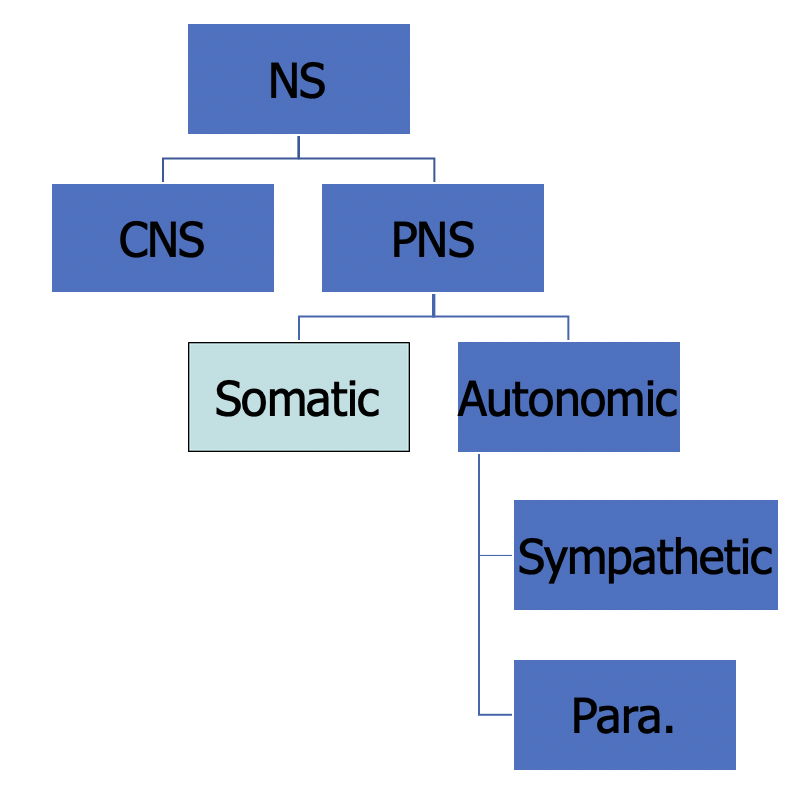

-   [1: Evolution of Psychology](#1-evolution-of-psychology)
    -   [History of Psychology](#history-of-psychology)
-   [2: Research Methods](#2-research-methods)
    -   [What is Research](#what-is-research)
    -   [Scientific Method](#scientific-method)
    -   [Experiments](#experiments)
    -   [Research Challenges](#research-challenges)
-   [3: Biological Bases](#3-biological-bases)
    -   [Terms](#terms)
    -   [Types of neural signals](#types-of-neural-signals)
    -   [Neurotransmitters](#neurotransmitters)
        -   [Common Neurotransmitters](#common-neurotransmitters)
    -   [Organization of Nervous System](#organization-of-nervous-system)
    -   [Methods to Study Brain](#methods-to-study-brain)
    -   [Development of Nervous System](#development-of-nervous-system)
    -   [Brain Physiology and Anatomy](#brain-physiology-and-anatomy)
    -   [Hereditary studies](#hereditary-studies)
    -   [The Evolutionary Bases of Behavior](#the-evolutionary-bases-of-behavior)
-   [4. Sensation and Perception](#4-sensation-and-perception)
    -   [Visual System](#visual-system)
        -   [Visual Pathway](#visual-pathway)
        -   [Theories of Color](#theories-of-color)
        -   [Perceiving Form](#perceiving-form)
    -   [Auditory System](#auditory-system)
    -   [Vestibular System](#vestibular-system)
    -   [Gustatory System](#gustatory-system)
    -   [Olfactory System](#olfactory-system)
    -   [Somatosensory System](#somatosensory-system)
-   [5. Variations in Consciousness](#5-variations-in-consciousness)
    -   [Behavioral/ Psychological Description of sleep](#behavioral-psychological-description-of-sleep)
    -   [Sleep](#sleep)
    -   [Factors Correlated with Sleeping Pattern](#factors-correlated-with-sleeping-pattern)
    -   [Effects of Sleep Deprivation](#effects-of-sleep-deprivation)
    -   [Effects of Sleep](#effects-of-sleep)
    -   [Sleep Disorders](#sleep-disorders)
    -   [Hypnosis](#hypnosis)
    -   [Meditation](#meditation)
    -   [Drugs](#drugs)
-   [6. Learning](#6-learning)
    -   [Classical Conditioning (Pavlovian Conditioning)](#classical-conditioning-pavlovian-conditioning)
        -   [History](#history)
        -   [Terms](#terms-1)
        -   [Acquisition](#acquisition)
        -   [Extinction](#extinction)
        -   [Stimulus Generalization and Discrimination](#stimulus-generalization-and-discrimination)
        -   [Higher-order Conditioning](#higher-order-conditioning)
        -   [Biological Influence on Conditioning](#biological-influence-on-conditioning)
    -   [Operant Conditioning (Instrumental Learning)](#operant-conditioning-instrumental-learning)
        -   [History](#history-1)
        -   [Terms](#terms-2)
        -   [Acquisition](#acquisition-1)
        -   [Extinction](#extinction-1)
        -   [Stimulus Generalization and Discrimination](#stimulus-generalization-and-discrimination-1)
        -   [Reinforcements](#reinforcements)
        -   [Biological Influence on Conditioning](#biological-influence-on-conditioning-1)
        -   [Cognition in Classical \& Operant Conditioning](#cognition-in-classical--operant-conditioning)
    -   [Observational Learning (modeling)](#observational-learning-modeling)
        -   [History](#history-2)
        -   [Terms](#terms-3)
-   [7. Memory](#7-memory)
    -   [Encoding](#encoding)

## 1: Evolution of Psychology

### History of Psychology

-   Philosophy (Descartes): Using the ability to reason
-   Physiology (Helmholtz): Using scientific method

**Significant contributors**

-   Wilhem Wundt (founder of psychology)
    -   First psychology laboratory, in Europe, 1879
    -   Reaction-time studies
-   Edward Titchener
    -   Structuralism: various components to everything (cannot exist by itself)
-   William James
    -   Functionalism: adaptiveness and evolution
    -   Established 1st psyc textbook, Principles of Psychology
-   Stanley Hall
    -   Functionalism
    -   Established 1st psyc laboratory in US
-   Sigmund Freud
    -   Psychoanalysis theory
    -   Unconscious: knowledge gained from working with patients were significant, results of his experimental research not significant
-   John B Watson
    -   Behaviorism
    -   Overt behavior & environmental factors: behaviors can be taught
    -   Facilitated an increase in using animals for research: researcher can exert more control over animals
-   B.F. Skinner
    -   Behaviorism
    -   Acknowledged biological factors & internal factors, but were considered to be unnecessary to understand/control behavior
    -   Free will as an illusion
-   Carl Rogers & Abraham Maslow
    -   Humanism: emphasize unique qualities of being human
    -   Self-concept/ incongruence, pyramid of needs
-   Noam Chomsky (language)
-   George Miller (memory)
-   Herbert Simon (problem-solving)
-   Roger Sperry (biological bases of behavior)

## 2: Research Methods

### What is Research

-   Process of gaining information in order to come to a conclusion
-   Goals
    -   Measurement and description
    -   Understanding and prediction
    -   Application and control
-   Guiding principles
    -   Rationalism
    -   Empiricism: taking observations through senses and forming conclusions

### Scientific Method

0. Get to know topic
    - Observation (direct or indirect)
1. Formulate a hypothesis
    - To be stated in terms of an operational definition
2. Design the study
    - Quasi-experiment: looks like an experiment, but independent variable has not been manipulated by experimenter
    - Non-experiment: naturalistic observation, case studies, surveys
    - Experiment: can make causal conclusions
    - Ethics should be considered
3. Collect the data
4. Analyze the data: draw conclusions
    - Descriptive statistics
        - Central tendency (mean, median, mode)
        - Correlation (r = .2: negligible, .5: moderate, .8: very strong, 1: perfect)
        - Inferential statistics (chi-test, F-test), used to tell probability that results were due to chance
5. Report the findings

### Experiments

-   To determine causality
-   Manipulate a variable, hold all other variables steady
-   Random assignment: decreases chances that your groups differ from one another before the manipulation
-   Extraneous variables: variables which may influence results though you are not interested in the effects (factor has been "controlled for")
-   Confounding variables: variables that influences results and make them unclear

### Research Challenges

-   Sampling bias (size)
-   Experimenter expectation/ bias
-   Participant expectation/ bias
-   Single-blind & double-blind studies

## 3: Biological Bases

### Terms

-   Soma: body of the cell which contains all organelles
-   Oligo (small/ a few) + dendro (tree-like branches)
-   Myelin sheath: insulating layer, or sheath that forms around nerves; allows electrical impulses to transmit quickly along the nerve cells
-   Glia ("glue" of the brain)
    -   Oligodendrocytes (CNS): one cell can create several segments of myelin sheath and cover more than one axon
    -   Schwann cells (PNS): one cell creates only one segment of myelin sheath for only one axon
    -   Astrocytes: synchronizes communication between neurons, nurtures cells, and removes waste products
    -   Microglia: functions as part of immune system, removes waste products and invaders
    -   Radial glia: guides migration and growth of immature neurons

### Types of neural signals

-   Synapses
    -   Axo-dendritic: connection formed between the axon of one neuron and the dendrite of another
    -   Axo-somatic: axon-soma
    -   Axo-axonic: axon-axon
-   Action potential (electric & chemical signal in axon)
    -   "all or none"
    -   Threshold of excitation must be met to fire an action potential
    -   Refractory period - interval of time during which a second action potential can be initiated
        -   Absolute: no matter how large stimulus is applied
        -   Relative: depends on stimulus size
-   Excitatory postsynaptic potential (EPSP) & inhibitory postsynaptive potential (IPSP)
    -   Electrical and chemical signals
    -   Only if EPSP > IPSP and reach threshold of excitation, then action potential in the 2nd neuron

### Neurotransmitters

-   At terminal buttons, there are vesicles full of chemicals called neurotransmitters
-   When action potential reaches the terminal buttons, exocytosis is triggered to occur (where the neurotransmitter is released from the vesicle)
-   Neurotransmitter diffuses across synapse from presynaptic neuron to postsynaptic neuron
-   Neurotransmitter finds receptors that it matches and binds to "binding site" of receptor
-   Binding causes either an excitatory postsynaptic potential or inhibitory postsynaptic potential
-   Neurotransmitter unbinds from receptor and reuptake/ enzymatic degradation occurs

#### Common Neurotransmitters

-   Agonist (increases activity) vs. antagonist (decreases activity)
-   GABA (inhibitory) vs glutamate (excitatory)
-   Acetylcholine/ ach/ cholinergic
    -   Binds with PNS: muscle contractions
    -   Binds with CNS: arousal, attention, learning
-   Monoamine -> catecholamine
    -   Dopamine/ DA
        -   Binds with CNS: movmenets, addictions, mood
    -   Norepinephrine/ NE
        -   Binds with CNS: mood, arousal
    -   Epinephrine/ Epi/ adrenergic (works on adrenaline)
        -   Binds with PNS: cardiac contraction
        -   Binds with CNS: mood
-   Monoamine -> indolamine
    -   Serotonin/ 5-HT/ serotonergic
        -   Binds with CNS: sleep/ arousal, mood, eating, aggression, impulsivity
-   Endorphins (endogenous + morphine)
    -   Type of neuropeptide to modulate pain

### Organization of Nervous System

-   CNS: central nervous system (spinal cord)
-   PNS: peripheral nervous system; lies outside brain and spinal cord
-   Afferent: "approaching" the brain
-   Efferent: "exiting" the brain

### Methods to Study Brain

-   Lesioning (controlled damage)
    -   Via knife cut, electrolytic lesion
-   Stimulation
    -   Via electrical stimulation, transcranial magnetic stimulation, chemical stimulation
-   Brain imaging
    -   Tools which give structural information: CT scan, MRI
    -   Tools which give functional information: PET scan (measures blood flow)
    -   Tools which give both: fMRI (measures blood flow and oxygen)

### Development of Nervous System

-   Neural tube development (~24 days)
    -   Neural tube defect: spina bifida, anecephaly
    -   Advised to take folic acid which is in prenatal vitamins
-   Neural tube continues to swell and grow
    -   Forebrain, mid brain, hindbrain and hollow center
    -   Telencephalon, diencephalon, mesencephalon (midbrain), metencephalon, myelencephalon (medulla)
    -   Telencephalon grows so much
-   Ventricles and central spinal fluid (CSF)
    -   Hollow areas filled with fluid CSF
    -   Cushions the brain inside and out

### Brain Physiology and Anatomy

-   Medial and lower in the brain -> primitive/ vital functions
-   Higher and outer areas of brain -> highest level of brain functions
-   **Hindbrain** (very base of the brain)
    -   medulla (connection between the brainstem and the spinal cord) - pons (relay signal below neck)
    -   cerebellum (controls balance for walking and standing, and other complex motor functions)
    -   reticular formation (major integration and relay center for many vital brain systems)
        -   ascending fibers: wakefulness/sleep
        -   descending fibers: motor movement
        -   aka reticular activating system
-   **Midbrain**
    -   visual information: superior colliculi
    -   auditory information: inferior colliculi
    -   DA-producing neurons: substantia nigra
    -   periaqueductal gray: area of brain involved with modulation of pain perception. For example, opioids can be released in this area and this leads to decreased perception of pain.
    -   periaqueductal gray: area of brain involved with modulation of pain perception
    -   reticular formation
-   **Forebrain**
    -   cerebral hemispheres
    -   corpus callosum
        -   split-brain research
    -   thalamus
        -   "sensory relay station" since all sensory information goes here before going to primary cortices, exception: olfactory
    -   hypothalamus
        -   controls pituitary in endocrine system which releases oxytocin to help women give birth and bond emotional
    -   limbic system
        -   network of different brain structures
    -   cerebral cortex (known as gray matter)
        -   higher mental functions are done
        -   sulcus/ sulci: a groove
        -   gyri: bump or ridge
        -   fissure: deep groove
        -   occipital lobe: houses primary visual cortex
        -   temporal lobe: houses primary auditory cortex
        -   parietal lobe: houses primary somatosensory cortex
        -   frontal lobe: houses primary motor cortex + mirror neurons + prefrontal lobe (executive functions)

### Hereditary studies

-   Three ways to estimate heritability:
    -   Family studies
        -   flaw: families do not share just genes, but also environment
    -   Twin studies
        -   flaw: the assumption that MZ and DZ twins only differ in terms of genes may be invalid; it’s possible that they experience different environments as well
    -   Adoption studies
        -   twin adoption study method: gather MZ & DZ twins who have been reared apart; compare concordance rate (of the target behavior) between the MZ & DZ twins
        -   flaw: sample sizes tend to be too small (esp. with the twin adoption study method)
        -   flaw: separating the twins does not ensure that they experience dissimilar environments (e.g., again, if they look alike, they may evoke the same social environment)
-   Epigenetics (heriditary changes in the characteristics of a cell or organism that result from altered gene expression or other effects not involving changes to the DNA sequence itself) marks can be passed down generations

### The Evolutionary Bases of Behavior

-   Darwin: traits which provide either **survival advantage** or **reproductive advantage** are much more likely to be “selected” over time (via natural selection)
-   Behavioral traits are subject to natural selection as well
    -   Population vs. individual organisms

## 4. Sensation and Perception

### Visual System

-   Stimulus: electromagnetic radiation between 480nm - 760nm
    -   Properties: wavelength, amplitude, purity (saturation)
-   Anatomy & physiology of the eye
    -   Cornea -> pupil/ iris -> lens -> vitreous humor -> retina (bipolar cells -> ganglion cells -> photoreceptors, rods and cones)
-   Transduction: process by which a stimulus is represented neurally
-   Photoreceptors
    -   | Rods                                | Cones                                                            |
        | ----------------------------------- | ---------------------------------------------------------------- |
        | Scotopic                            | Photopic                                                         |
        | Perceives general form (not detail) | Greater visual acuity                                            |
        | More numerous than cones            | Less numerous than rods                                          |
        | More in the periphery of the retina | More in center of retina and there are only cones in the fovea   |
        | More thoroughly adapts to the dark  | Quickly adapts to the dark, but is limited in how much it adapts |
-   Receptive field: portion of the visual field which a neuron "monitors"

#### Visual Pathway

-   After light is transduced by cones/ rods, visual information processed:
    -   Bipolar cells
    -   Ganglion cells
    -   Optic disk (has optic nerves to transfer signals to the brain)
-   Information received by the halves of the retina closer to the nose
    -   crosses to the other side of the brain to form the optic chiasm (contralateral connection)
    -   dorsal lateral geniculate nucleus of the thalamus
    -   primary visual cortex (in occipital lobe) aka V1 aka striate cortex
-   Information received by the halves of the retina farthest from the nose
    -   stays on the same side of the brain (ipsilateral connection)
    -   dorsal lateral geniculate nucleus of the thalamus
    -   primary visual cortex (in occipital lobe) aka V1 aka striate cortex
-   In the primary visual cortex
    -   Simple cells: detect orientation of line and location of the line within its receptive field
    -   Complex cells: detect orientation of line, movement of line
-   Visual information goes to the
    -   WHAT pathway: lower part of temporal lobe, analyzes what the object is
    -   WHERE pathway: parietal lobe, analyzes where the object is

#### Theories of Color

-   Trichromatic theory (proposed by Young, refined by Helmholtz)
    -   Brain detects 3 main colors, and variations of them will give colors of the rainbow
-   Opponent process theory (proposed by Hering)
    -   Neurons that can communicate to the brain that can see one color at one time (seeing one color takes opposing or opposite actions, cannot have two at the same time)
    -   Explains complementary afterimages (rebound effect: staring at a waterfall will make things look like they are elevated)

#### Perceiving Form

-   Bottom-up processing (aka feature detection)
    -   Basic visual information are compiled so that visual cortical cells
-   Top-down processing (information is taken as a "whole")
    -   See structure and patterns in order for us to better understand the environment
    -   Gestalt principles: similarity, continuation, closure, proximity, figure/ground, and symmetry & order
-   Stroop effect: naming color when spelt another color (interference of the processes)
-   Depth perception
    -   Monocular cues: accomodation of one eye
    -   Binocular cues: retinal disparaity used to calculate depth; slight difference in images received by each eye due to horizontal separation

### Auditory System

-   Stimulus: sound (compression and decompression of molecules)
-   Properties: wavelength, amplitude, purity (timbre, quality of sound)
-   Anatomy of ear:
    -   Outer ear (ear canal/ pinna) -> middle ear (ear drum/ tympanic membrane -> ossicles) -> inner eat (oval window of cochlea)
    -   Cochlea
        -   3 canals: in the middle canal is the basiclar membrane (with auditory hair cells)
        -   Vibration moves the fluid, and basilar membrane moves
        -   Auditory hair cells fire action potential
-   Place theory
    -   Different waveforms stimulate different areas of the basilar membrane
    -   Higher frequencies stimulate basilar membrane areas closest to oval window, vice-versa
-   Frequency theory
    -   Basilar membrane mimics the sound waveform
    -   Neurons at the end of the basilar membrane fire in synchrony with waveform

### Vestibular System

-   Sense of balance
-   Stimulus: gravitational pull
-   Anatomy of vestibular system
    -   Located in inner ear near the cochlea
    -   Has semiciruclar canals and vestibular sacs

### Gustatory System

-   Stimulus: molecules dissolved in fluid
-   Anatomy of tongue:
    -   Papillae = bumps
    -   Taste buds (many on sides of papillae)
-   Primary cortex: insular cortex in frontal lobe

### Olfactory System

-   Stimulus: molecules in air
-   Anatomy of nose:
    -   Air -> mucous -> olfactory dedrites (transduction occurs)
-   Primary cortex: olfactory bulb (temporal lobe)

### Somatosensory System

-   Stimulus: mechanical, thermal, chemical
-   Anatomical system involed: nerves in th ebody
    -   Mechanoreceptors: ruffini endings, merkel’s discs, pacinian corpuscles, meissner’s corpuscle, hair shaft sensory receptor
    -   Nociceptors: free nerve endings
    -   Thermoreceptors
    -   Proprioceptors
-   Pain
    -   Stimulus: something noxious or damaging to tissues (exception: some forms of chronic pain)
    -   Anatomy of pain system: noniceptors
        -   C fibers: slow pathway (e.g., dull, aching)
        -   A-delta fibers: fast pathway (e.g., sharp pain of a knife cut)
    -   Gate control theory by Melzack and Wall (theory of how we modulate pain)
        -   Triggers: central nervous system (brain can send stimulation to close pain gates)
        -   Peripheral nervous system (rubbing area around an injury works, because other sematosensory nerves are stimulated in that area, synapses - pain & rubbing - compete to get to the spinal cord, stopping pain)

## 5. Variations in Consciousness

### Behavioral/ Psychological Description of sleep

-   Alert/ Awake
    -   Beta waves
    -   13 - 24 cycles per second
-   Relaxed, drowsy
    -   Alpha waves
    -   8 - 12 cycles per second
-   Stage 1
    -   Theta waves
    -   4 - 7 cycles per second
-   Stage 2
    -   Theta waves
    -   4 - 7 cycles per second
-   Stage 3: slow wave sleep (SWS)
    -   0 - 49% delta waves
    -   <4 cycles per second
-   Stage 4: slow wave sleep (SWS)
    -   Above 50% delta waves
    -   <4 cycles per second
-   REM
    -   High frequency, low amplitude waves
    -   Beta waves, some alpha waves

### Sleep

-   What drives sleepiness
    -   Metabolic processes (mostly active brain)
    -   Circadian rhythm
-   Circadian rhythm
    -   Regulated by suprachiasmatic nuclues (hypothalamus)
    -   SCN -> pineal gland -> melatonin -> increase sleepiness
    -   Can be entrained by light

### Factors Correlated with Sleeping Pattern

-   Age
    -   Infants: greater total sleep and amount of REM (50%, compared to 20% in adults)
    -   More than 70: 50% decrease in SWS, slight decrease in REM
-   Genetics/ biology
-   Cultural variations

### Effects of Sleep Deprivation

-   Complete deprivation: weariness, irritability, paranois, lapses in attention, memory deficits, hallucinations
-   Partial/ restricted deprivation: inconsistent effects, increased sleepiness, impairments of attention, reaction time, motor coordination, decision making, endocrine and immune system function
-   Correlated with increased accidents and higher rates of physical issues
-   Rebound effects of selective REM and SWS deprivation (brain will increasingly insist on sleep stage when deprived)
-   Mortality rate and sleep amounts correlated (greatest mortality when sleep is less than 7h and more than 9h)

### Effects of Sleep

-   Cognitive: brain development
    -   IQ
    -   Memory consolidation
    -   Insights during REM
-   Energy conservation
    -   Marine mammals have the ability to sleep halfway
    -   Restore bodily resources
-   Dreams
    -   Adults: focused on self
        -   Sex, aggression, misfortune
        -   Content of waking life spill into dreams (Frued's "day residue")
    -   Children: more static than storyline
    -   Theories of purposes:
        -   Frued: wish fulfillment
        -   R. Cartwright: problem-solving/ mood-regulation view
        -   Hobson: activation-synthesis model

### Sleep Disorders

-   Hypersomnia: excessive sleepiness for at least 1 month
    -   TX: stimulants
-   Insomnia: difficulty initiating or maintain sleep for at least 1 month
    -   More common in women, increase with age, variety of negative health conditions correlated
    -   TX: teach good sleep hygiene, relaxation training, benzodiazepines, non-benzodiazepines (e.g. Ambien, Sonata, Lunesta), melatonin
-   Narcolepsy: irresistable attacks of refreshing sleep that occur daily over at least 3 months
    -   Presence of one or more of:
        -   Cataplexy: brief loss of voluntary muscle tone triggered by strong emotions
        -   Hypnogogic: Occur when you're falling asleep
        -   Hypnopompic hallucinations: Occur when you're waking up
        -   Sleep paralysis
    -   TX: stimulants, SSRIs
-   Sleep apnea: breathing stops randomly ~10sec/ 10-15 min per hour of sleep
    -   Associated to obesity and age
    -   TX: CPAP, lifestyle modifications, upper airway and craniofacial surgery
-   Somnambulism: sleep walking
-   REM sleep behavior disorder:
    -   Being chased or attacked in dreams
    -   Deterioration of brain stem
    -   May precede Parkinson's up to 10 years

### Hypnosis

-   Systematic procedure that typically produces a heightened state of suggestibility
-   Associative features
    -   Anesthesia
    -   Sensory distortions/ hallucinations
    -   Disinhibition
    -   Post hypnotic suggestions and amnesia may occur
    -   Hilgard's dissociative theory: hypnotic induction is said to split the functioning of the executive control system (ECS) into different streams
    -   Highway hypnosis: altered mental state in which an automobile driver can drive lengthy distances and respond adequately to external events with no recollection of consciously having done so

### Meditation

-   Practices that train attention to heighten awareness and bring mental processes under greater voluntary control
-   Associative features
    -   EEG: increase in alpha and theta waves
    -   Transcendant experience is not equal to relaxation
    -   Correlated with: decrease stress, anxiety, BP; increase immune function, mood, self-esteem, overall health and well-being
    -   Decreased parietal lobe activity (where somatosensory system resides)
    -   Increased left prefrontal lobe activity

### Drugs

-   Narcotics
    -   E.g. morphine, heroin, oxycodone, codeine, methadone
    -   Effects:
    -   anxiety reduction, pain relief, drowsiness
    -   impaired mental & motor functioning
    -   constipation
    -   withdrawal: severe diarrhea, etc.
    -   increase in infectious diseases
    -   used for: analgesic, cough, diarrhea
    -   Sedatives: CNS depressants
        -   E.g. barbiturates, benzodiazepines
        -   Effects:
            -   relaxation, anxiety, increased drowsiness
            -   quick tolerance/medication backfires
            -   impaired mental & physical functioning
            -   increased risk of accidents
            -   synergistic effect with alcohol
            -   withdrawal can be potentially dangerous
            -   used for anxiety, sleeping issues
    -   Stimulants: increase CNS activity
        -   E.g. caffeine, nicotine, cocaine/crack, amphetamines/crank/crystal meth, MDMA (low doses; in high doses, MDMA can have hallucinogenic effects)
        -   Effects:
            -   euphoria
            -   increased energy, alertness, CV arousal and/or CV problems, panic, insomnia, sweating/urination
            -   psychosis: when people lose some contact with reality (e.g., cocaine, amphetamines)
            -   decreased appetite
            -   (cocaine, for example): damaged nasal membranes, increased CV and respiratory problems
            -   used for narcolepsy, ADHD (methylphenidate), local anesthetic (cocaine)
    -   Hallucinogens: small amount alters sensory/perception
        -   E.g. LSD, mescaline (peyote), psilocybin (mushroom), MDMA too (“ecstasy”), though in larger dose
        -   Effects:
            -   euphoria, distortions in sensory & perceptual experiences (e.g., mystical experiences)
            -   anxiety, paranoia (“bad trip”)
            -   kills 5-HT neurons
            -   impaired judgment → ↑ risk of accidents
    -   Cannabis
        -   E.g. marijuana, hashish, THC (Tetrahydrocannabinol, a cannabinoid found in cannabis)
        -   Effects:
            -   mild euphoria, relaxation, sensory/perceptual distortions (e.g., “slowing of time,” vivid perceptions), increased hunger, esp. for sweets
            -   short-term memory impairments, metabolizes slowly
            -   decreased IQ in young users
            -   persistent memory issues in middle aged users (even after stopping use)
            -   increased accident risk
            -   used for: TX of nausea & pain, e.g., cancer, glaucoma
    -   (ethyl) Alcohol
        -   Effects:
            -   mild euphoria, relaxation, mood swings, quarrelsomeness
            -   90% student rapes, 95% on violent crimes on campus
            -   impairments of cognitive & motor function
            -   21% unplanned sex, 50% fatal vehicle accidents (according to some sources) , ~40% fatal bicycle accidents
            -   liver damage (cirrhosis, which is scarring), hypertension, stroke, other heart diseases, neurological issues (e.g., Korsakoff’s syndrome), Korsakoff symptoms include severe memory problems, apathy, walking problems, etc., cancers
            -   increased risk of death in general - males: 2x increased mortality, females: 4x increased mortality
        -   withdrawal could be fatal
            -   delirium tremens—can be fatal in some cases
            -   is characterized by “the shakes” as well as by symptoms of delirium, which include cognitive deficits, changes in CNS arousal, and psychotic features like hallucinations & delusions
        -   a standard drink has 0.6 oz. of alcohol

## 6. Learning

-   Learning refers to the change in a person's behavior to a given situation brought about by repeated experiences in that situation, provided the behavior change cannot be explained on the basis of native response tendencies, maturation, or temporary states of the subject

### Classical Conditioning (Pavlovian Conditioning)

#### History

-   Pavlov & psychic reflexes demonstration

#### Terms

-   Unconditioned stimulus (US or UCS)
    -   naturally elicits a response
-   Unconditioned response (UR)
    -   natural response to US
-   Conditioned stimulus (CS)
    -   a previously neutral stimulus which, after pairings with a US, attains the ability to elicit the same response
-   Conditioned response (CR)
    -   the response to the CS (which looks like the UR, at least on the surface, and not in all cases)

#### Acquisition

-   stimulus contiguity
    -   simultaneous presentation (of UCS & CS)
        -   tone & meat are presented and ended at same time
    -   short-delayed presentation
        -   tone begins shortly before meat
        -   tone & meat end at same time
    -   trace presentation
        -   tone is presented & ended right before the meat is presented then ended
-   saliency of stimulus
    -   stimulus which is most noticeable is more likely a good potential CS

#### Extinction

-   Weaking asociation by presenting CS without UCS
-   Spontaneous recovery (after a period of non-exposure to CS)
-   Renewal effect (after re-exposure to environment where learning ocurred)

#### Stimulus Generalization and Discrimination

-   Stimulus generalization: when a person generalizes what they have learned from a specific CS to other stimuli which are similar to the original CS
    -   e.g., if you have been classically conditioned to be scared of Bozo and then are later scared of all clowns
-   Stimulus discrimination: when a person does NOT generalize what they have learned from a specific CS to other stimuli which are similar to the original CS
    -   e.g., if you have been classically conditioned to be scared of Bozo but are not scared of other clowns (so you are discriminating between Bozo and the other clowns)

#### Higher-order Conditioning

-   When a CS functions as a UCS
-   Example: A makes you happy, B provides A so B makes you happy (1st order), C provides B provides A so C makes you happy (2nd order)

#### Biological Influence on Conditioning

-   Conditioned taste aversion
    -   one trial
    -   extended delay between CS & US presentation
    -   food stimuli-nausea associations are likely
-   Evolutionarily adaptative
-   CS: ecologically relevant vs. arbitrary, neutral stimulus

### Operant Conditioning (Instrumental Learning)

#### History

-   B.F. Skinner (1904 – 1990): demonstrated that organisms repeat those responses that are followed by favorable consequences and organisms tend not to repeat those responses that are followed by negative and/or neutral consequence
-   Skinner box
    -   Reinforcement contingencies
    -   Cumulative recorder

#### Terms

-   reinforcement: consequence that increases tendency to repeat preceding behavior
    -   positive reinforcement: adding something into the situation that increases the tendency to repeat the preceding behavior
    -   negative reinforcement: taking something away from the situation that increases the tendency to repeat the preceding behavior
-   punishment: consequence that ↓ tendency to repeat preceding behavior
    -   (positive) punishment: adding something into the situation that decreases the tendency to repeat the preceding behavior
    -   (negative) punishment: taking something out of the situation that decreases the tendency to repeat the preceding behavior

#### Acquisition

-   When the connection between the behavior and a consequence is "aquired"
-   Shaping: reinforcements fo closer and closer approximations of a desired response

#### Extinction

-   Process where the usual consequence does not follow the emitted behavior
-   Resistance to extinction
-   Renewal effect

#### Stimulus Generalization and Discrimination

-   stimulus generalization: hold onto the association between the stimulus (and alike) and consequence
-   stimulus discrimination: only associate the stimulus (specifically only that stimulus) and consequence

#### Reinforcements

-   Primary reinforcers are those which directly satisfy our biological needs
-   Secondary reinforcers are those which are associated with primary reinforcements (e.g. money)
-   Schedules of Reinforcements
    -   continuous reinforcement
        -   reinforcement after every single target behavior
    -   intermittent reinforcement
        -   fixed-ratio schedule
            -   reinforcement is given based on a fixed number of responses (e.g., every third response)
        -   variable-ratio schedule
            -   reinforcement is given based on an average number of responses (e.g., reinforcement is given, on average, 4 responses)
        -   fixed-interval schedule
            -   reinforcement is given based on the first response given after a fixed amount of time has passed (e.g., reinforcement is given if a rat pulls a lever after 4 seconds have passed)
        -   variable-interval schedule
            -   reinforcement is given based on the first response given after an average amount of time has passed (e.g., reinforcement is given if a rat pulls a level, on average, after 3 seconds have passed)
-   Special issue concerning positive punishment
    -   e.g., corporeal punishment
    -   poor-quality parent-child relationship, e.g. increased aggression, delinquency, behavior problems. Long term effects: associated with slowed cognitive development, increased criminal behavior, range of mental health issues (cited in Weiten)
    -   correlational data; however, strong evidence for a causal relationship

#### Biological Influence on Conditioning

-   Instinctive drift
    -   Operant conditioning is not always successful
    -   Operant conditioning which tries to go against natural instinct usually fails
-   Preparedness and Phobias
-   Classical conditioning and operant conditioning are often used together, e.g. phobias
    -   classical conditioning establishes the phobia
    -   operant conditioning maintains the phobia
-   behavior of avoiding = decreased anxiety = reinforcing = increased likelihood that person will avoid the object of anxiety

#### Cognition in Classical & Operant Conditioning

-   Latent Learning & Cognitive Maps (Edward Tolman, 1930s & 1940s)
    -   1st group: reinforcement was given after every trial (through a maze) -> steadily improved
    -   2nd group: no reinforcements were given -> little improvement
    -   3rd group: reinforcements were given after the 10th trial onward -> sharply improved behavior
    -   => learning can take place without reinforcement
    -   mental representation of a map is possible
-   Signal Relations - predictive value of conditioned stimulus (Robert Rescorla, 1970s & 1980s)
    -   1st group: a tone signaled a shock every single time -> strong response
    -   2nd group: a tone signaled a shock only half of the time -> weaker response
    -   somewhere in the organism’s mind, the predictive value of the environmental cue is being calculated

### Observational Learning (modeling)

#### History

-   Albert Bandura (1970s, 1980s): suggest that many different cognitive processes could be involved with learning including internal processes which allow one to learn vicariously (so vicarious classical and operant conditioning)

#### Terms

-   cognitive processes which may be involved with this type of learning (attention, retention, reproduction, motivation)

## 7. Memory

### Encoding

-   Attention
    -   Focusing awareness onto something
